```python
import pandas as pd
import seaborn as sns
import numpy as np
import matplotlib.pyplot as plt
```


```python
ds = pd.read_csv("Australian Vehicle Prices.csv")

ds
```


<div>
<style scoped>
    .dataframe tbody tr th:only-of-type {
        vertical-align: middle;
    }

    .dataframe tbody tr th {
        vertical-align: top;
    }

    .dataframe thead th {
        text-align: right;
    }
</style>
<table border="1" class="dataframe">
  <thead>
    <tr style="text-align: right;">
      <th></th>
      <th>Brand</th>
      <th>Year</th>
      <th>Model</th>
      <th>Car/Suv</th>
      <th>Title</th>
      <th>UsedOrNew</th>
      <th>Transmission</th>
      <th>Engine</th>
      <th>DriveType</th>
      <th>FuelType</th>
      <th>FuelConsumption</th>
      <th>Kilometres</th>
      <th>ColourExtInt</th>
      <th>Location</th>
      <th>CylindersinEngine</th>
      <th>BodyType</th>
      <th>Doors</th>
      <th>Seats</th>
      <th>Price</th>
    </tr>
  </thead>
  <tbody>
    <tr>
      <th>0</th>
      <td>Ssangyong</td>
      <td>2022.0</td>
      <td>Rexton</td>
      <td>Sutherland Isuzu Ute</td>
      <td>2022 Ssangyong Rexton Ultimate (awd)</td>
      <td>DEMO</td>
      <td>Automatic</td>
      <td>4 cyl, 2.2 L</td>
      <td>AWD</td>
      <td>Diesel</td>
      <td>8.7 L / 100 km</td>
      <td>5595</td>
      <td>White / Black</td>
      <td>Caringbah, NSW</td>
      <td>4 cyl</td>
      <td>SUV</td>
      <td>4 Doors</td>
      <td>7 Seats</td>
      <td>51990</td>
    </tr>
    <tr>
      <th>1</th>
      <td>MG</td>
      <td>2022.0</td>
      <td>MG3</td>
      <td>Hatchback</td>
      <td>2022 MG MG3 Auto Excite (with Navigation)</td>
      <td>USED</td>
      <td>Automatic</td>
      <td>4 cyl, 1.5 L</td>
      <td>Front</td>
      <td>Premium</td>
      <td>6.7 L / 100 km</td>
      <td>16</td>
      <td>Black / Black</td>
      <td>Brookvale, NSW</td>
      <td>4 cyl</td>
      <td>Hatchback</td>
      <td>5 Doors</td>
      <td>5 Seats</td>
      <td>19990</td>
    </tr>
    <tr>
      <th>2</th>
      <td>BMW</td>
      <td>2022.0</td>
      <td>430I</td>
      <td>Coupe</td>
      <td>2022 BMW 430I M Sport</td>
      <td>USED</td>
      <td>Automatic</td>
      <td>4 cyl, 2 L</td>
      <td>Rear</td>
      <td>Premium</td>
      <td>6.6 L / 100 km</td>
      <td>8472</td>
      <td>Grey / White</td>
      <td>Sylvania, NSW</td>
      <td>4 cyl</td>
      <td>Coupe</td>
      <td>2 Doors</td>
      <td>4 Seats</td>
      <td>108988</td>
    </tr>
    <tr>
      <th>3</th>
      <td>Mercedes-Benz</td>
      <td>2011.0</td>
      <td>E500</td>
      <td>Coupe</td>
      <td>2011 Mercedes-Benz E500 Elegance</td>
      <td>USED</td>
      <td>Automatic</td>
      <td>8 cyl, 5.5 L</td>
      <td>Rear</td>
      <td>Premium</td>
      <td>11 L / 100 km</td>
      <td>136517</td>
      <td>White / Brown</td>
      <td>Mount Druitt, NSW</td>
      <td>8 cyl</td>
      <td>Coupe</td>
      <td>2 Doors</td>
      <td>4 Seats</td>
      <td>32990</td>
    </tr>
    <tr>
      <th>4</th>
      <td>Renault</td>
      <td>2022.0</td>
      <td>Arkana</td>
      <td>SUV</td>
      <td>2022 Renault Arkana Intens</td>
      <td>USED</td>
      <td>Automatic</td>
      <td>4 cyl, 1.3 L</td>
      <td>Front</td>
      <td>Unleaded</td>
      <td>6 L / 100 km</td>
      <td>1035</td>
      <td>Grey / Black</td>
      <td>Castle Hill, NSW</td>
      <td>4 cyl</td>
      <td>SUV</td>
      <td>4 Doors</td>
      <td>5 Seats</td>
      <td>34990</td>
    </tr>
    <tr>
      <th>...</th>
      <td>...</td>
      <td>...</td>
      <td>...</td>
      <td>...</td>
      <td>...</td>
      <td>...</td>
      <td>...</td>
      <td>...</td>
      <td>...</td>
      <td>...</td>
      <td>...</td>
      <td>...</td>
      <td>...</td>
      <td>...</td>
      <td>...</td>
      <td>...</td>
      <td>...</td>
      <td>...</td>
      <td>...</td>
    </tr>
    <tr>
      <th>16729</th>
      <td>Toyota</td>
      <td>2014.0</td>
      <td>Alphard</td>
      <td>SYC Cars</td>
      <td>2014 Toyota Alphard</td>
      <td>USED</td>
      <td>Automatic</td>
      <td>-</td>
      <td>Front</td>
      <td>Unleaded</td>
      <td>-</td>
      <td>66000</td>
      <td>Grey / -</td>
      <td>Rocklea, QLD</td>
      <td>-</td>
      <td>Commercial</td>
      <td>7 Seats</td>
      <td>NaN</td>
      <td>29500</td>
    </tr>
    <tr>
      <th>16730</th>
      <td>Mercedes-Benz</td>
      <td>2012.0</td>
      <td>S-Class</td>
      <td>USED Dealer ad</td>
      <td>2012 Mercedes-Benz S-Class CDI BlueTEC</td>
      <td>USED</td>
      <td>Automatic</td>
      <td>-</td>
      <td>Rear</td>
      <td>Diesel</td>
      <td>-</td>
      <td>117432</td>
      <td>Silver / -</td>
      <td>Port Melbourne, VIC</td>
      <td>-</td>
      <td>NaN</td>
      <td>NaN</td>
      <td>NaN</td>
      <td>39888</td>
    </tr>
    <tr>
      <th>16731</th>
      <td>Suzuki</td>
      <td>2022.0</td>
      <td>Vitara</td>
      <td>Bremer Suzuki - New</td>
      <td>2022 Suzuki Vitara 1.6L</td>
      <td>DEMO</td>
      <td>Automatic</td>
      <td>4 cyl, 1.6 L</td>
      <td>Front</td>
      <td>Unleaded</td>
      <td>6.2 L / 100 km</td>
      <td>5165</td>
      <td>Yellow / -</td>
      <td>Dinmore, QLD</td>
      <td>4 cyl</td>
      <td>SUV</td>
      <td>4 Doors</td>
      <td>5 Seats</td>
      <td>35280</td>
    </tr>
    <tr>
      <th>16732</th>
      <td>Mercedes-Benz</td>
      <td>2016.0</td>
      <td>GLC250</td>
      <td>SUV</td>
      <td>2016 Mercedes-Benz GLC250</td>
      <td>USED</td>
      <td>Automatic</td>
      <td>4 cyl, 2 L</td>
      <td>AWD</td>
      <td>Premium</td>
      <td>7.2 L / 100 km</td>
      <td>85525</td>
      <td>Grey / Black</td>
      <td>Albion, QLD</td>
      <td>4 cyl</td>
      <td>SUV</td>
      <td>4 Doors</td>
      <td>5 Seats</td>
      <td>41888</td>
    </tr>
    <tr>
      <th>16733</th>
      <td>Mercedes-Benz</td>
      <td>2021.0</td>
      <td>C200</td>
      <td>Sedan</td>
      <td>2021 Mercedes-Benz C200</td>
      <td>USED</td>
      <td>Automatic</td>
      <td>4 cyl, 2 L</td>
      <td>Rear</td>
      <td>Unleaded</td>
      <td>7 L / 100 km</td>
      <td>31852</td>
      <td>Gold / -</td>
      <td>Yatala, QLD</td>
      <td>4 cyl</td>
      <td>Sedan</td>
      <td>4 Doors</td>
      <td>5 Seats</td>
      <td>65888</td>
    </tr>
  </tbody>
</table>
<p>16734 rows × 19 columns</p>
</div>


```python
dsinfo = ds.info()

ds_summary = ds.describe()

print(dsinfo)
print(ds_summary)

ds.isnull().sum()
```

    <class 'pandas.core.frame.DataFrame'>
    RangeIndex: 16734 entries, 0 to 16733
    Data columns (total 19 columns):
     #   Column             Non-Null Count  Dtype  
    ---  ------             --------------  -----  
     0   Brand              16733 non-null  object 
     1   Year               16733 non-null  float64
     2   Model              16733 non-null  object 
     3   Car/Suv            16706 non-null  object 
     4   Title              16733 non-null  object 
     5   UsedOrNew          16733 non-null  object 
     6   Transmission       16733 non-null  object 
     7   Engine             16733 non-null  object 
     8   DriveType          16733 non-null  object 
     9   FuelType           16733 non-null  object 
     10  FuelConsumption    16733 non-null  object 
     11  Kilometres         16733 non-null  object 
     12  ColourExtInt       16733 non-null  object 
     13  Location           16284 non-null  object 
     14  CylindersinEngine  16733 non-null  object 
     15  BodyType           16452 non-null  object 
     16  Doors              15130 non-null  object 
     17  Seats              15029 non-null  object 
     18  Price              16731 non-null  object 
    dtypes: float64(1), object(18)
    memory usage: 2.4+ MB
    None
                   Year
    count  16733.000000
    mean    2016.229248
    std        5.247705
    min     1940.000000
    25%     2013.000000
    50%     2017.000000
    75%     2020.000000
    max     2023.000000
    


    Brand                   1
    Year                    1
    Model                   1
    Car/Suv                28
    Title                   1
    UsedOrNew               1
    Transmission            1
    Engine                  1
    DriveType               1
    FuelType                1
    FuelConsumption         1
    Kilometres              1
    ColourExtInt            1
    Location              450
    CylindersinEngine       1
    BodyType              282
    Doors                1604
    Seats                1705
    Price                   3
    dtype: int64


```python
ds_dup = ds.duplicated()

ds_null = ds.isnull()

print(ds_dup)
print(ds_null)
```

    0        False
    1        False
    2        False
    3        False
    4        False
             ...  
    16729    False
    16730    False
    16731    False
    16732    False
    16733    False
    Length: 16734, dtype: bool
           Brand   Year  Model  Car/Suv  Title  UsedOrNew  Transmission  Engine  \
    0      False  False  False    False  False      False         False   False   
    1      False  False  False    False  False      False         False   False   
    2      False  False  False    False  False      False         False   False   
    3      False  False  False    False  False      False         False   False   
    4      False  False  False    False  False      False         False   False   
    ...      ...    ...    ...      ...    ...        ...           ...     ...   
    16729  False  False  False    False  False      False         False   False   
    16730  False  False  False    False  False      False         False   False   
    16731  False  False  False    False  False      False         False   False   
    16732  False  False  False    False  False      False         False   False   
    16733  False  False  False    False  False      False         False   False   
    
           DriveType  FuelType  FuelConsumption  Kilometres  ColourExtInt  \
    0          False     False            False       False         False   
    1          False     False            False       False         False   
    2          False     False            False       False         False   
    3          False     False            False       False         False   
    4          False     False            False       False         False   
    ...          ...       ...              ...         ...           ...   
    16729      False     False            False       False         False   
    16730      False     False            False       False         False   
    16731      False     False            False       False         False   
    16732      False     False            False       False         False   
    16733      False     False            False       False         False   
    
           Location  CylindersinEngine  BodyType  Doors  Seats  Price  
    0         False              False     False  False  False  False  
    1         False              False     False  False  False  False  
    2         False              False     False  False  False  False  
    3         False              False     False  False  False  False  
    4         False              False     False  False  False  False  
    ...         ...                ...       ...    ...    ...    ...  
    16729     False              False     False  False   True  False  
    16730     False              False      True   True   True  False  
    16731     False              False     False  False  False  False  
    16732     False              False     False  False  False  False  
    16733     False              False     False  False  False  False  
    
    [16734 rows x 19 columns]
    


```python
ds.drop(['Doors', 'Seats', 'ColourExtInt'],axis=1,inplace=True)
```


```python
#Change data values "Commercial", "Van" in "BodyType" column

ds.loc[ds['BodyType'] == "Commercial", "BodyType"] = "Van"

ds[ds['BodyType'] == "Van"].head()
```


<div>
<style scoped>
    .dataframe tbody tr th:only-of-type {
        vertical-align: middle;
    }

    .dataframe tbody tr th {
        vertical-align: top;
    }

    .dataframe thead th {
        text-align: right;
    }
</style>
<table border="1" class="dataframe">
  <thead>
    <tr style="text-align: right;">
      <th></th>
      <th>Brand</th>
      <th>Year</th>
      <th>Model</th>
      <th>Car/Suv</th>
      <th>Title</th>
      <th>UsedOrNew</th>
      <th>Transmission</th>
      <th>Engine</th>
      <th>DriveType</th>
      <th>FuelType</th>
      <th>FuelConsumption</th>
      <th>Kilometres</th>
      <th>Location</th>
      <th>CylindersinEngine</th>
      <th>BodyType</th>
      <th>Price</th>
    </tr>
  </thead>
  <tbody>
    <tr>
      <th>5</th>
      <td>Toyota</td>
      <td>2004.0</td>
      <td>Estima</td>
      <td>ON FOUR WHEELS</td>
      <td>2004 Toyota Estima T EDITION</td>
      <td>USED</td>
      <td>Automatic</td>
      <td>-</td>
      <td>Other</td>
      <td>Unleaded</td>
      <td>-</td>
      <td>160230</td>
      <td>Saint Marys, NSW</td>
      <td>-</td>
      <td>Van</td>
      <td>9990</td>
    </tr>
    <tr>
      <th>10</th>
      <td>Toyota</td>
      <td>2009.0</td>
      <td>HiAce</td>
      <td>Carbarn</td>
      <td>2009 Toyota HiAce (No Badge)</td>
      <td>USED</td>
      <td>Automatic</td>
      <td>-</td>
      <td>Other</td>
      <td>Unleaded</td>
      <td>-</td>
      <td>148190</td>
      <td>Lidcombe, NSW</td>
      <td>-</td>
      <td>Van</td>
      <td>42500</td>
    </tr>
    <tr>
      <th>11</th>
      <td>Toyota</td>
      <td>2018.0</td>
      <td>HiAce</td>
      <td>Commercial</td>
      <td>2018 Toyota HiAce LWB</td>
      <td>USED</td>
      <td>Automatic</td>
      <td>4 cyl, 2.7 L</td>
      <td>Rear</td>
      <td>Unleaded</td>
      <td>9.8 L / 100 km</td>
      <td>16324</td>
      <td>Lidcombe, NSW</td>
      <td>4 cyl</td>
      <td>Van</td>
      <td>41999</td>
    </tr>
    <tr>
      <th>14</th>
      <td>Toyota</td>
      <td>2016.0</td>
      <td>HiAce</td>
      <td>Commercial</td>
      <td>2016 Toyota HiAce LWB</td>
      <td>USED</td>
      <td>Automatic</td>
      <td>4 cyl, 3 L</td>
      <td>Rear</td>
      <td>Diesel</td>
      <td>8 L / 100 km</td>
      <td>229829</td>
      <td>Lidcombe, NSW</td>
      <td>4 cyl</td>
      <td>Van</td>
      <td>27995</td>
    </tr>
    <tr>
      <th>40</th>
      <td>Toyota</td>
      <td>2009.0</td>
      <td>HiAce</td>
      <td>Nippon Motors</td>
      <td>2009 Toyota HiAce (No Badge)</td>
      <td>USED</td>
      <td>Automatic</td>
      <td>-</td>
      <td>Rear</td>
      <td>Unleaded</td>
      <td>-</td>
      <td>76259</td>
      <td>Ingleburn, NSW</td>
      <td>-</td>
      <td>Van</td>
      <td>32900</td>
    </tr>
  </tbody>
</table>
</div>


```python
# Ensure no NaN values in 'Model' and 'Title' columns
ds['Model'] = ds['Model'].fillna('')
ds['Title'] = ds['Title'].fillna('')

# Update 'BodyType' for models starting with "HiAce"
ds.loc[ds['Model'].str.startswith("HIACE"), "BodyType"] = "Van"

# Standardize 'HiAce' to 'Hiace' in the 'Model' and 'Title' columns
ds['Model'] = ds['Model'].str.replace('HiAce', 'Hiace', regex=False)
ds['Title'] = ds['Title'].str.replace('HiAce', 'Hiace', regex=False)

# Verify changes
changed_ds = ds[ds['Model'].str.contains("Hiace")]
changed_ds2 = ds[ds['Title'].str.contains("Hiace")]

# Print results for verification

```


```python
# Check if 'Location' exists in the DataFrame
if 'Location' in ds.columns:
    # Extract the last 3 characters from the 'Location' column and assign to 'States'
    ds['States'] = ds['Location'].str[-3:]
else:
    print("Column 'Location' does not exist.")

```


```python
if 'Location' in ds.columns:
    # Extract the last 3 characters
    states_values = ds['Location'].str[-3:]
    
    # Get the position of 'Location'
    location_index = ds.columns.get_loc('Location')
    
    # Insert 'States' next to 'Location'
    if 'States' in ds.columns:
        ds.drop(columns=['States'], inplace=True)
    ds.insert(location_index + 1, 'States', states_values)
else:
    print("Column 'Location' does not exist.")

```


```python
# Changing Brand name "Land Rover"

ds.loc[ds['Brand'] == "Land", "Brand"] = "Land Rover"

ds[ds['Brand'] == "Land Rover"].head()
```


<div>
<style scoped>
    .dataframe tbody tr th:only-of-type {
        vertical-align: middle;
    }

    .dataframe tbody tr th {
        vertical-align: top;
    }

    .dataframe thead th {
        text-align: right;
    }
</style>
<table border="1" class="dataframe">
  <thead>
    <tr style="text-align: right;">
      <th></th>
      <th>Brand</th>
      <th>Year</th>
      <th>Model</th>
      <th>Car/Suv</th>
      <th>Title</th>
      <th>UsedOrNew</th>
      <th>Transmission</th>
      <th>Engine</th>
      <th>DriveType</th>
      <th>FuelType</th>
      <th>FuelConsumption</th>
      <th>Kilometres</th>
      <th>Location</th>
      <th>States</th>
      <th>CylindersinEngine</th>
      <th>BodyType</th>
      <th>Price</th>
    </tr>
  </thead>
  <tbody>
    <tr>
      <th>6</th>
      <td>Land Rover</td>
      <td>2017.0</td>
      <td>Rover</td>
      <td>SUV</td>
      <td>2017 Land Rover Range Rover Evoque TD4 180 HSE...</td>
      <td>USED</td>
      <td>Automatic</td>
      <td>4 cyl, 2 L</td>
      <td>AWD</td>
      <td>Diesel</td>
      <td>5.1 L / 100 km</td>
      <td>67662</td>
      <td>Blacktown, NSW</td>
      <td>NSW</td>
      <td>4 cyl</td>
      <td>SUV</td>
      <td>62280</td>
    </tr>
    <tr>
      <th>152</th>
      <td>Land Rover</td>
      <td>2013.0</td>
      <td>Rover</td>
      <td>SUV</td>
      <td>2013 Land Rover Discovery 4 3.0 TDV6</td>
      <td>USED</td>
      <td>Automatic</td>
      <td>6 cyl, 3 L</td>
      <td>4WD</td>
      <td>Diesel</td>
      <td>8.8 L / 100 km</td>
      <td>159558</td>
      <td>Glebe, NSW</td>
      <td>NSW</td>
      <td>6 cyl</td>
      <td>SUV</td>
      <td>38950</td>
    </tr>
    <tr>
      <th>246</th>
      <td>Land Rover</td>
      <td>2020.0</td>
      <td>Rover</td>
      <td>SUV</td>
      <td>2020 Land Rover Range Rover Evoque P200 S (147KW)</td>
      <td>USED</td>
      <td>Automatic</td>
      <td>4 cyl, 2 L</td>
      <td>AWD</td>
      <td>Premium</td>
      <td>8.1 L / 100 km</td>
      <td>26227</td>
      <td>Rozelle, NSW</td>
      <td>NSW</td>
      <td>4 cyl</td>
      <td>SUV</td>
      <td>69800</td>
    </tr>
    <tr>
      <th>285</th>
      <td>Land Rover</td>
      <td>2015.0</td>
      <td>Rover</td>
      <td>SUV</td>
      <td>2015 Land Rover Discovery 4 3.0 SDV6 HSE</td>
      <td>USED</td>
      <td>Automatic</td>
      <td>6 cyl, 3 L</td>
      <td>4WD</td>
      <td>Diesel</td>
      <td>8.8 L / 100 km</td>
      <td>139968</td>
      <td>Castle Hill, NSW</td>
      <td>NSW</td>
      <td>6 cyl</td>
      <td>SUV</td>
      <td>54990</td>
    </tr>
    <tr>
      <th>339</th>
      <td>Land Rover</td>
      <td>2004.0</td>
      <td>Rover</td>
      <td>Auto Outlet Direct</td>
      <td>2004 Land Rover Range Rover HSE</td>
      <td>USED</td>
      <td>Automatic</td>
      <td>-</td>
      <td>Other</td>
      <td>Diesel</td>
      <td>-</td>
      <td>236221</td>
      <td>Five Dock, NSW</td>
      <td>NSW</td>
      <td>-</td>
      <td>Wagon</td>
      <td>9999</td>
    </tr>
  </tbody>
</table>
</div>


```python
def categorized_title(title, brand):
    # Return the original title for non-Land Rover cars
    if brand != "Land Rover":  
        return title

    # Check for missing values
    if pd.isna(title):  
        return "Not Found"
        
    # Convert to string to handle non-string values
    title = str(title)  
    if "Evoque" in title:
        return "Evoque"
    elif "Discovery" in title:
        return "Discovery"
    elif "HSE" in title:
        return "HSE"
    elif "Vogue" in title:
        return "Vogue"
    elif "Velar" in title:
        return "Velar"
    elif "Autobiography" in title:
        return "Autobiography"
    elif "Sport" in title:
        return "Sport"
    elif "P530" in title:
        return "P530"
    elif "Defender" in title:
        return "Defender"
    elif "Freelander" in title:
        return "Freelander"
    elif "P525" in title:
        return "P525"
    elif "D300" in title:
        return "D300"
    elif "D350" in title:
        return "D350"
    else:
        return "Not Found"

# Apply the function
ds['Model'] = ds.apply(lambda row: categorized_title(row['Title'], row['Brand']), axis=1)

ds[ds['Brand'] == "Land Rover"].head()
```


<div>
<style scoped>
    .dataframe tbody tr th:only-of-type {
        vertical-align: middle;
    }

    .dataframe tbody tr th {
        vertical-align: top;
    }

    .dataframe thead th {
        text-align: right;
    }
</style>
<table border="1" class="dataframe">
  <thead>
    <tr style="text-align: right;">
      <th></th>
      <th>Brand</th>
      <th>Year</th>
      <th>Model</th>
      <th>Car/Suv</th>
      <th>Title</th>
      <th>UsedOrNew</th>
      <th>Transmission</th>
      <th>Engine</th>
      <th>DriveType</th>
      <th>FuelType</th>
      <th>FuelConsumption</th>
      <th>Kilometres</th>
      <th>Location</th>
      <th>States</th>
      <th>CylindersinEngine</th>
      <th>BodyType</th>
      <th>Price</th>
    </tr>
  </thead>
  <tbody>
    <tr>
      <th>6</th>
      <td>Land Rover</td>
      <td>2017.0</td>
      <td>Evoque</td>
      <td>SUV</td>
      <td>2017 Land Rover Range Rover Evoque TD4 180 HSE...</td>
      <td>USED</td>
      <td>Automatic</td>
      <td>4 cyl, 2 L</td>
      <td>AWD</td>
      <td>Diesel</td>
      <td>5.1 L / 100 km</td>
      <td>67662</td>
      <td>Blacktown, NSW</td>
      <td>NSW</td>
      <td>4 cyl</td>
      <td>SUV</td>
      <td>62280</td>
    </tr>
    <tr>
      <th>152</th>
      <td>Land Rover</td>
      <td>2013.0</td>
      <td>Discovery</td>
      <td>SUV</td>
      <td>2013 Land Rover Discovery 4 3.0 TDV6</td>
      <td>USED</td>
      <td>Automatic</td>
      <td>6 cyl, 3 L</td>
      <td>4WD</td>
      <td>Diesel</td>
      <td>8.8 L / 100 km</td>
      <td>159558</td>
      <td>Glebe, NSW</td>
      <td>NSW</td>
      <td>6 cyl</td>
      <td>SUV</td>
      <td>38950</td>
    </tr>
    <tr>
      <th>246</th>
      <td>Land Rover</td>
      <td>2020.0</td>
      <td>Evoque</td>
      <td>SUV</td>
      <td>2020 Land Rover Range Rover Evoque P200 S (147KW)</td>
      <td>USED</td>
      <td>Automatic</td>
      <td>4 cyl, 2 L</td>
      <td>AWD</td>
      <td>Premium</td>
      <td>8.1 L / 100 km</td>
      <td>26227</td>
      <td>Rozelle, NSW</td>
      <td>NSW</td>
      <td>4 cyl</td>
      <td>SUV</td>
      <td>69800</td>
    </tr>
    <tr>
      <th>285</th>
      <td>Land Rover</td>
      <td>2015.0</td>
      <td>Discovery</td>
      <td>SUV</td>
      <td>2015 Land Rover Discovery 4 3.0 SDV6 HSE</td>
      <td>USED</td>
      <td>Automatic</td>
      <td>6 cyl, 3 L</td>
      <td>4WD</td>
      <td>Diesel</td>
      <td>8.8 L / 100 km</td>
      <td>139968</td>
      <td>Castle Hill, NSW</td>
      <td>NSW</td>
      <td>6 cyl</td>
      <td>SUV</td>
      <td>54990</td>
    </tr>
    <tr>
      <th>339</th>
      <td>Land Rover</td>
      <td>2004.0</td>
      <td>HSE</td>
      <td>Auto Outlet Direct</td>
      <td>2004 Land Rover Range Rover HSE</td>
      <td>USED</td>
      <td>Automatic</td>
      <td>-</td>
      <td>Other</td>
      <td>Diesel</td>
      <td>-</td>
      <td>236221</td>
      <td>Five Dock, NSW</td>
      <td>NSW</td>
      <td>-</td>
      <td>Wagon</td>
      <td>9999</td>
    </tr>
  </tbody>
</table>
</div>


```python
ds.loc[ds['BodyType'] == "Ute / Tray", "BodyType"] = "UTE"
```


```python
ds[ds['BodyType'] == "UTE"]
```


<div>
<style scoped>
    .dataframe tbody tr th:only-of-type {
        vertical-align: middle;
    }

    .dataframe tbody tr th {
        vertical-align: top;
    }

    .dataframe thead th {
        text-align: right;
    }
</style>
<table border="1" class="dataframe">
  <thead>
    <tr style="text-align: right;">
      <th></th>
      <th>Brand</th>
      <th>Year</th>
      <th>Model</th>
      <th>Car/Suv</th>
      <th>Title</th>
      <th>UsedOrNew</th>
      <th>Transmission</th>
      <th>Engine</th>
      <th>DriveType</th>
      <th>FuelType</th>
      <th>FuelConsumption</th>
      <th>Kilometres</th>
      <th>Location</th>
      <th>States</th>
      <th>CylindersinEngine</th>
      <th>BodyType</th>
      <th>Price</th>
    </tr>
  </thead>
  <tbody>
    <tr>
      <th>22</th>
      <td>Volkswagen</td>
      <td>2023.0</td>
      <td>2023 Volkswagen Amarok Style TDI600 4Motion</td>
      <td>Alto Volkswagen New Cars</td>
      <td>2023 Volkswagen Amarok Style TDI600 4Motion</td>
      <td>NEW</td>
      <td>Automatic</td>
      <td>6 cyl, 3 L</td>
      <td>AWD</td>
      <td>Diesel</td>
      <td>8.4 L / 100 km</td>
      <td>15</td>
      <td>Blacktown, NSW</td>
      <td>NSW</td>
      <td>6 cyl</td>
      <td>UTE</td>
      <td>83887</td>
    </tr>
    <tr>
      <th>44</th>
      <td>Mitsubishi</td>
      <td>2016.0</td>
      <td>2016 Mitsubishi Triton GLX Plus (4X4)</td>
      <td>Ute / Tray</td>
      <td>2016 Mitsubishi Triton GLX Plus (4X4)</td>
      <td>USED</td>
      <td>Automatic</td>
      <td>4 cyl, 2.4 L</td>
      <td>4WD</td>
      <td>Diesel</td>
      <td>7.6 L / 100 km</td>
      <td>240402</td>
      <td>Haberfield, NSW</td>
      <td>NSW</td>
      <td>4 cyl</td>
      <td>UTE</td>
      <td>22750</td>
    </tr>
    <tr>
      <th>79</th>
      <td>Holden</td>
      <td>2010.0</td>
      <td>2010 Holden Commodore SS-V</td>
      <td>Ute / Tray</td>
      <td>2010 Holden Commodore SS-V</td>
      <td>USED</td>
      <td>Manual</td>
      <td>8 cyl, 6 L</td>
      <td>Rear</td>
      <td>Unleaded</td>
      <td>14.5 L / 100 km</td>
      <td>169220</td>
      <td>Blacktown, NSW</td>
      <td>NSW</td>
      <td>8 cyl</td>
      <td>UTE</td>
      <td>25999</td>
    </tr>
    <tr>
      <th>81</th>
      <td>Mazda</td>
      <td>2018.0</td>
      <td>2018 Mazda BT-50 XTR (4X2)</td>
      <td>Ute / Tray</td>
      <td>2018 Mazda BT-50 XTR (4X2)</td>
      <td>USED</td>
      <td>Automatic</td>
      <td>5 cyl, 3.2 L</td>
      <td>Rear</td>
      <td>Diesel</td>
      <td>9.3 L / 100 km</td>
      <td>97460</td>
      <td>Haberfield, NSW</td>
      <td>NSW</td>
      <td>5 cyl</td>
      <td>UTE</td>
      <td>30990</td>
    </tr>
    <tr>
      <th>126</th>
      <td>Ford</td>
      <td>2016.0</td>
      <td>2016 Ford Ranger XLT 3.2 (4X4)</td>
      <td>Ute / Tray</td>
      <td>2016 Ford Ranger XLT 3.2 (4X4)</td>
      <td>USED</td>
      <td>Automatic</td>
      <td>5 cyl, 3.2 L</td>
      <td>4WD</td>
      <td>Diesel</td>
      <td>9 L / 100 km</td>
      <td>98700</td>
      <td>Five Dock, NSW</td>
      <td>NSW</td>
      <td>5 cyl</td>
      <td>UTE</td>
      <td>36999</td>
    </tr>
    <tr>
      <th>...</th>
      <td>...</td>
      <td>...</td>
      <td>...</td>
      <td>...</td>
      <td>...</td>
      <td>...</td>
      <td>...</td>
      <td>...</td>
      <td>...</td>
      <td>...</td>
      <td>...</td>
      <td>...</td>
      <td>...</td>
      <td>...</td>
      <td>...</td>
      <td>...</td>
      <td>...</td>
    </tr>
    <tr>
      <th>16666</th>
      <td>Mitsubishi</td>
      <td>2015.0</td>
      <td>2015 Mitsubishi Triton GLX (4X4)</td>
      <td>Ute / Tray</td>
      <td>2015 Mitsubishi Triton GLX (4X4)</td>
      <td>USED</td>
      <td>Automatic</td>
      <td>4 cyl, 2.4 L</td>
      <td>4WD</td>
      <td>Diesel</td>
      <td>7.6 L / 100 km</td>
      <td>115860</td>
      <td>Moorabbin, VIC</td>
      <td>VIC</td>
      <td>4 cyl</td>
      <td>UTE</td>
      <td>33950</td>
    </tr>
    <tr>
      <th>16669</th>
      <td>Mitsubishi</td>
      <td>2010.0</td>
      <td>2010 Mitsubishi Triton GLX (4X4)</td>
      <td>Ute / Tray</td>
      <td>2010 Mitsubishi Triton GLX (4X4)</td>
      <td>USED</td>
      <td>Automatic</td>
      <td>4 cyl, 2.5 L</td>
      <td>4WD</td>
      <td>Diesel</td>
      <td>9.9 L / 100 km</td>
      <td>257447</td>
      <td>Avondale Heights, VIC</td>
      <td>VIC</td>
      <td>4 cyl</td>
      <td>UTE</td>
      <td>15999</td>
    </tr>
    <tr>
      <th>16715</th>
      <td>Mitsubishi</td>
      <td>2015.0</td>
      <td>2015 Mitsubishi Triton GLX (4X4)</td>
      <td>Ute / Tray</td>
      <td>2015 Mitsubishi Triton GLX (4X4)</td>
      <td>USED</td>
      <td>Automatic</td>
      <td>4 cyl, 2.5 L</td>
      <td>4WD</td>
      <td>Diesel</td>
      <td>9.3 L / 100 km</td>
      <td>106756</td>
      <td>Dandenong, VIC</td>
      <td>VIC</td>
      <td>4 cyl</td>
      <td>UTE</td>
      <td>27850</td>
    </tr>
    <tr>
      <th>16719</th>
      <td>Ford</td>
      <td>2019.0</td>
      <td>2019 Ford Ranger XL 3.2 (4X4)</td>
      <td>Ute / Tray</td>
      <td>2019 Ford Ranger XL 3.2 (4X4)</td>
      <td>USED</td>
      <td>Automatic</td>
      <td>5 cyl, 3.2 L</td>
      <td>4WD</td>
      <td>Diesel</td>
      <td>8.7 L / 100 km</td>
      <td>45837</td>
      <td>Dingley Village, VIC</td>
      <td>VIC</td>
      <td>5 cyl</td>
      <td>UTE</td>
      <td>47990</td>
    </tr>
    <tr>
      <th>16724</th>
      <td>Nissan</td>
      <td>2009.0</td>
      <td>2009 Nissan Navara ST (4X4)</td>
      <td>Ute / Tray</td>
      <td>2009 Nissan Navara ST (4X4)</td>
      <td>USED</td>
      <td>Automatic</td>
      <td>4 cyl, 2.5 L</td>
      <td>4WD</td>
      <td>Diesel</td>
      <td>10.5 L / 100 km</td>
      <td>182254</td>
      <td>Bacchus Marsh, VIC</td>
      <td>VIC</td>
      <td>4 cyl</td>
      <td>UTE</td>
      <td>16000</td>
    </tr>
  </tbody>
</table>
<p>2512 rows × 17 columns</p>
</div>


```python
ds.loc[ds['BodyType'] == "Other", "BodyType"] = ""

ds[ds['BodyType'] == "Other"]
```


<div>
<style scoped>
    .dataframe tbody tr th:only-of-type {
        vertical-align: middle;
    }

    .dataframe tbody tr th {
        vertical-align: top;
    }

    .dataframe thead th {
        text-align: right;
    }
</style>
<table border="1" class="dataframe">
  <thead>
    <tr style="text-align: right;">
      <th></th>
      <th>Brand</th>
      <th>Year</th>
      <th>Model</th>
      <th>Car/Suv</th>
      <th>Title</th>
      <th>UsedOrNew</th>
      <th>Transmission</th>
      <th>Engine</th>
      <th>DriveType</th>
      <th>FuelType</th>
      <th>FuelConsumption</th>
      <th>Kilometres</th>
      <th>Location</th>
      <th>States</th>
      <th>CylindersinEngine</th>
      <th>BodyType</th>
      <th>Price</th>
    </tr>
  </thead>
  <tbody>
  </tbody>
</table>
</div>


```python
ds.isnull().sum()
```


    Brand                  1
    Year                   1
    Model                  0
    Car/Suv               28
    Title                  0
    UsedOrNew              1
    Transmission           1
    Engine                 1
    DriveType              1
    FuelType               1
    FuelConsumption        1
    Kilometres             1
    Location             450
    States               450
    CylindersinEngine      1
    BodyType             282
    Price                  3
    dtype: int64


```python
# Keywords for each body type
bodytype_keywords = {
    "Sedan": ["City", "C-CLASS", "Impreza", "Calais", "3", "5", "7", "A3", "A5", "RS", "190", "Corolla", "WRX", 
              "S-Class", "Skyline", "Axela", "Cruze", "Accord", "Sai", "E-CLASS", "Crown", "Lancer", "Jetta", 
              "S60", "M3", "Prius", "Model", "Camry", "Sonata", "Cerato", "A4", "Commodore", "Altezza", "Falcon", 
              "C320", "HS", "Flying", "6", "Sebring", "Century", "Berlina", "XJ", "300", "508", "Stanza", "120", 
              "2002", "Model 3", "Pulsar", "C200", "Ghibli"],
    "SUV": ["RAV4", "CR-V", "Tucson", "CX-5", "Forester", "Land Cruiser", "Pajero", "Outlander", "X5", "Kuga", "H2", 
            "Rover", "D90", "Evoque", "Discovery", "Landcruiser", "Sport"],
    "Hatchback": ["Yaris", "2", "Focus", "Golf", "Clio", "i30", "Civic", "Fiesta", "Swift", "Micra", "Tiida", 
                  "Fit", "Note", "MK", "Getz", "Ractis"],
    "UTE": ["Hilux", "Ranger", "Navara", "Colorado", "BT-50", "D-Max", "Triton", "Amarok", "Gladiator", "FPV", 
            "GS", "T60", "Ducato"],
    "Van": ["Hiace", "Transit", "Carnival", "Vito", "Caddy", "iLoad", "Every", "Deliver", "G10+", "Crafter", 
            "Sprinters", "Delivers"],
    "Convertible": ["MX-5", "Z4", "718", "Mustang Convertible", "TT Roadster", "Cabrio", "Corvette"],
    "Wagon": ["Passat", "Outback", "Levorg", "V60", "E-Class Wagon", "Commodore Wagon"],
    "People Mover": ["Alphard", "Vellfire", "Mifa"],
    "Truck": ["Atlas", "Trucks", "NMR", "NLS", "NLR", "Hijet"]
}

# Function to determine the body type from model (case insensitive and cleans spaces)
def get_body_type(model):
    model = model.strip().lower()  # Convert model to lowercase and strip spaces
    for body_type, keywords in bodytype_keywords.items():
        if any(keyword.lower() in model for keyword in keywords):
            return body_type
    return "Not Found"  # If no match found

# Ensure 'BodyType' column exists in the dataframe
ds['BodyType'] = ds.get('BodyType', '')

# Fill missing values only where BodyType is blank or NaN
ds['BodyType'] = ds.apply(lambda row: get_body_type(row['Model'])
                          if pd.isna(row['BodyType']) or row['BodyType'] == ''
                          else row['BodyType'], axis=1)

# Display updated rows for validation
print(ds.loc[ds['BodyType'] == 'Not Found', ['Model', 'BodyType']].head())

```

         Model   BodyType
    2391        Not Found
    


```python
ds = ds[ds['BodyType'] != 'Not Found']
```


```python
# Define the models and their respective body types to be updated
model_to_bodytype = {
    "Hijet": "Truck",
    "Alphard": "People Mover",
    "Vellfire": "People Mover",
    "Crafter": "Van",
    "Hiace": "Van"
}

# Function to update the BodyType based on the model
def update_bodytype(row):
    for model, body_type in model_to_bodytype.items():
        if model in row['Model']:
            return body_type
    return row['BodyType']  # Keep the original value if no match is found

# Apply the function to the BodyType column using .loc to avoid SettingWithCopyWarning
ds.loc[:, 'BodyType'] = ds.apply(update_bodytype, axis=1)

# Display some rows to verify the update
print(ds.loc[ds['Model'].str.contains('Hijet|Alphard|Vellfire|Crafter|Hiace', case=False), ['Model', 'BodyType']].head())

```

                               Model BodyType
    10  2009 Toyota Hiace (No Badge)      Van
    11         2018 Toyota Hiace LWB      Van
    13             2017 Toyota Hiace      Van
    14         2016 Toyota Hiace LWB      Van
    40  2009 Toyota Hiace (No Badge)      Van
    


```python
# Remove 'cyl' from CylindersinEngine and convert to numeric using .loc to avoid SettingWithCopyWarning
ds.loc[:, 'CylindersinEngine'] = ds['CylindersinEngine'].str.replace(r'\D', '', regex=True)
ds.loc[:, 'CylindersinEngine'] = pd.to_numeric(ds['CylindersinEngine'], errors='coerce')

# Move 'CylindersinEngine' next to 'Engine'
columns = ds.columns.tolist()
columns.remove('CylindersinEngine')
engine_index = columns.index('Engine')
columns.insert(engine_index + 1, 'CylindersinEngine')
ds = ds[columns]

```


```python
# Clean 'Engine' column by keeping only the engine size and removing the cylinder count, retaining 'L' for clarity
ds['Engine'] = ds['Engine'].str.extract(r'(\d+\.\d+|\d+)(?:\s*L)', expand=False)

# Extract only the first decimal number and ignore invalid entries
ds['FuelConsumption'] = ds['FuelConsumption'].astype(str).str.extract(r'(\d+\.\d+|\d+)', expand=False)
ds['FuelConsumption'] = pd.to_numeric(ds['FuelConsumption'], errors='coerce').round(1)

# Convert 'Year' column to integer without decimal places
if 'Year' in ds.columns:
    ds['Year'] = pd.to_numeric(ds['Year'], errors='coerce').astype('Int64')
    
ds.head(50)

```


<div>
<style scoped>
    .dataframe tbody tr th:only-of-type {
        vertical-align: middle;
    }

    .dataframe tbody tr th {
        vertical-align: top;
    }

    .dataframe thead th {
        text-align: right;
    }
</style>
<table border="1" class="dataframe">
  <thead>
    <tr style="text-align: right;">
      <th></th>
      <th>Brand</th>
      <th>Year</th>
      <th>Model</th>
      <th>Car/Suv</th>
      <th>Title</th>
      <th>UsedOrNew</th>
      <th>Transmission</th>
      <th>Engine</th>
      <th>CylindersinEngine</th>
      <th>DriveType</th>
      <th>FuelType</th>
      <th>FuelConsumption</th>
      <th>Kilometres</th>
      <th>Location</th>
      <th>States</th>
      <th>BodyType</th>
      <th>Price</th>
    </tr>
  </thead>
  <tbody>
    <tr>
      <th>0</th>
      <td>Ssangyong</td>
      <td>2022</td>
      <td>2022 Ssangyong Rexton Ultimate (awd)</td>
      <td>Sutherland Isuzu Ute</td>
      <td>2022 Ssangyong Rexton Ultimate (awd)</td>
      <td>DEMO</td>
      <td>Automatic</td>
      <td>2.2</td>
      <td>4.0</td>
      <td>AWD</td>
      <td>Diesel</td>
      <td>8.7</td>
      <td>5595</td>
      <td>Caringbah, NSW</td>
      <td>NSW</td>
      <td>SUV</td>
      <td>51990</td>
    </tr>
    <tr>
      <th>1</th>
      <td>MG</td>
      <td>2022</td>
      <td>2022 MG MG3 Auto Excite (with Navigation)</td>
      <td>Hatchback</td>
      <td>2022 MG MG3 Auto Excite (with Navigation)</td>
      <td>USED</td>
      <td>Automatic</td>
      <td>1.5</td>
      <td>4.0</td>
      <td>Front</td>
      <td>Premium</td>
      <td>6.7</td>
      <td>16</td>
      <td>Brookvale, NSW</td>
      <td>NSW</td>
      <td>Hatchback</td>
      <td>19990</td>
    </tr>
    <tr>
      <th>2</th>
      <td>BMW</td>
      <td>2022</td>
      <td>2022 BMW 430I M Sport</td>
      <td>Coupe</td>
      <td>2022 BMW 430I M Sport</td>
      <td>USED</td>
      <td>Automatic</td>
      <td>2</td>
      <td>4.0</td>
      <td>Rear</td>
      <td>Premium</td>
      <td>6.6</td>
      <td>8472</td>
      <td>Sylvania, NSW</td>
      <td>NSW</td>
      <td>Coupe</td>
      <td>108988</td>
    </tr>
    <tr>
      <th>3</th>
      <td>Mercedes-Benz</td>
      <td>2011</td>
      <td>2011 Mercedes-Benz E500 Elegance</td>
      <td>Coupe</td>
      <td>2011 Mercedes-Benz E500 Elegance</td>
      <td>USED</td>
      <td>Automatic</td>
      <td>5.5</td>
      <td>8.0</td>
      <td>Rear</td>
      <td>Premium</td>
      <td>11.0</td>
      <td>136517</td>
      <td>Mount Druitt, NSW</td>
      <td>NSW</td>
      <td>Coupe</td>
      <td>32990</td>
    </tr>
    <tr>
      <th>4</th>
      <td>Renault</td>
      <td>2022</td>
      <td>2022 Renault Arkana Intens</td>
      <td>SUV</td>
      <td>2022 Renault Arkana Intens</td>
      <td>USED</td>
      <td>Automatic</td>
      <td>1.3</td>
      <td>4.0</td>
      <td>Front</td>
      <td>Unleaded</td>
      <td>6.0</td>
      <td>1035</td>
      <td>Castle Hill, NSW</td>
      <td>NSW</td>
      <td>SUV</td>
      <td>34990</td>
    </tr>
    <tr>
      <th>5</th>
      <td>Toyota</td>
      <td>2004</td>
      <td>2004 Toyota Estima T EDITION</td>
      <td>ON FOUR WHEELS</td>
      <td>2004 Toyota Estima T EDITION</td>
      <td>USED</td>
      <td>Automatic</td>
      <td>NaN</td>
      <td>NaN</td>
      <td>Other</td>
      <td>Unleaded</td>
      <td>NaN</td>
      <td>160230</td>
      <td>Saint Marys, NSW</td>
      <td>NSW</td>
      <td>Van</td>
      <td>9990</td>
    </tr>
    <tr>
      <th>6</th>
      <td>Land Rover</td>
      <td>2017</td>
      <td>Evoque</td>
      <td>SUV</td>
      <td>2017 Land Rover Range Rover Evoque TD4 180 HSE...</td>
      <td>USED</td>
      <td>Automatic</td>
      <td>2</td>
      <td>4.0</td>
      <td>AWD</td>
      <td>Diesel</td>
      <td>5.1</td>
      <td>67662</td>
      <td>Blacktown, NSW</td>
      <td>NSW</td>
      <td>SUV</td>
      <td>62280</td>
    </tr>
    <tr>
      <th>7</th>
      <td>Nissan</td>
      <td>2000</td>
      <td>2000 Nissan Pulsar LX</td>
      <td>Hatchback</td>
      <td>2000 Nissan Pulsar LX</td>
      <td>USED</td>
      <td>Automatic</td>
      <td>1.6</td>
      <td>4.0</td>
      <td>Front</td>
      <td>Unleaded</td>
      <td>8.0</td>
      <td>300539</td>
      <td>Wentworthville, NSW</td>
      <td>NSW</td>
      <td>Hatchback</td>
      <td>2995</td>
    </tr>
    <tr>
      <th>8</th>
      <td>Toyota</td>
      <td>2013</td>
      <td>2013 Toyota 86 GT</td>
      <td>Coupe</td>
      <td>2013 Toyota 86 GT</td>
      <td>USED</td>
      <td>Automatic</td>
      <td>2</td>
      <td>4.0</td>
      <td>Rear</td>
      <td>Premium</td>
      <td>7.1</td>
      <td>82012</td>
      <td>Mcgraths Hill, NSW</td>
      <td>NSW</td>
      <td>Coupe</td>
      <td>24888</td>
    </tr>
    <tr>
      <th>9</th>
      <td>Honda</td>
      <td>2014</td>
      <td>2014 Honda Jazz Hybrid</td>
      <td>Hatchback</td>
      <td>2014 Honda Jazz Hybrid</td>
      <td>USED</td>
      <td>Automatic</td>
      <td>1.3</td>
      <td>4.0</td>
      <td>Front</td>
      <td>Hybrid</td>
      <td>4.5</td>
      <td>38229</td>
      <td>Lidcombe, NSW</td>
      <td>NSW</td>
      <td>Hatchback</td>
      <td>17900</td>
    </tr>
    <tr>
      <th>10</th>
      <td>Toyota</td>
      <td>2009</td>
      <td>2009 Toyota Hiace (No Badge)</td>
      <td>Carbarn</td>
      <td>2009 Toyota Hiace (No Badge)</td>
      <td>USED</td>
      <td>Automatic</td>
      <td>NaN</td>
      <td>NaN</td>
      <td>Other</td>
      <td>Unleaded</td>
      <td>NaN</td>
      <td>148190</td>
      <td>Lidcombe, NSW</td>
      <td>NSW</td>
      <td>Van</td>
      <td>42500</td>
    </tr>
    <tr>
      <th>11</th>
      <td>Toyota</td>
      <td>2018</td>
      <td>2018 Toyota Hiace LWB</td>
      <td>Commercial</td>
      <td>2018 Toyota Hiace LWB</td>
      <td>USED</td>
      <td>Automatic</td>
      <td>2.7</td>
      <td>4.0</td>
      <td>Rear</td>
      <td>Unleaded</td>
      <td>9.8</td>
      <td>16324</td>
      <td>Lidcombe, NSW</td>
      <td>NSW</td>
      <td>Van</td>
      <td>41999</td>
    </tr>
    <tr>
      <th>12</th>
      <td>Honda</td>
      <td>2015</td>
      <td>2015 Honda City GM VTi-L Sedan 4dr CVT 7sp 1.5...</td>
      <td>USED Dealer ad</td>
      <td>2015 Honda City GM VTi-L Sedan 4dr CVT 7sp 1.5...</td>
      <td>USED</td>
      <td>Automatic</td>
      <td>NaN</td>
      <td>NaN</td>
      <td>Other</td>
      <td>Unleaded</td>
      <td>NaN</td>
      <td>181745</td>
      <td>Rouse Hill, NSW</td>
      <td>NSW</td>
      <td>Sedan</td>
      <td>11999</td>
    </tr>
    <tr>
      <th>13</th>
      <td>Toyota</td>
      <td>2017</td>
      <td>2017 Toyota Hiace</td>
      <td>USED Dealer ad</td>
      <td>2017 Toyota Hiace</td>
      <td>USED</td>
      <td>Automatic</td>
      <td>NaN</td>
      <td>NaN</td>
      <td>Other</td>
      <td>-</td>
      <td>NaN</td>
      <td>136296</td>
      <td>Lidcombe, NSW</td>
      <td>NSW</td>
      <td>Van</td>
      <td>38999</td>
    </tr>
    <tr>
      <th>14</th>
      <td>Toyota</td>
      <td>2016</td>
      <td>2016 Toyota Hiace LWB</td>
      <td>Commercial</td>
      <td>2016 Toyota Hiace LWB</td>
      <td>USED</td>
      <td>Automatic</td>
      <td>3</td>
      <td>4.0</td>
      <td>Rear</td>
      <td>Diesel</td>
      <td>8.0</td>
      <td>229829</td>
      <td>Lidcombe, NSW</td>
      <td>NSW</td>
      <td>Van</td>
      <td>27995</td>
    </tr>
    <tr>
      <th>15</th>
      <td>Volkswagen</td>
      <td>2012</td>
      <td>2012 Volkswagen Golf 90 TSI Trendline</td>
      <td>Hatchback</td>
      <td>2012 Volkswagen Golf 90 TSI Trendline</td>
      <td>USED</td>
      <td>Automatic</td>
      <td>1.4</td>
      <td>4.0</td>
      <td>Front</td>
      <td>Premium</td>
      <td>6.2</td>
      <td>55676</td>
      <td>Five Dock, NSW</td>
      <td>NSW</td>
      <td>Hatchback</td>
      <td>14999</td>
    </tr>
    <tr>
      <th>16</th>
      <td>BMW</td>
      <td>2014</td>
      <td>2014 BMW X3 Xdrive 20D</td>
      <td>SUV</td>
      <td>2014 BMW X3 Xdrive 20D</td>
      <td>USED</td>
      <td>Automatic</td>
      <td>2</td>
      <td>4.0</td>
      <td>4WD</td>
      <td>Diesel</td>
      <td>5.6</td>
      <td>82624</td>
      <td>Haberfield, NSW</td>
      <td>NSW</td>
      <td>SUV</td>
      <td>24985</td>
    </tr>
    <tr>
      <th>17</th>
      <td>Mitsubishi</td>
      <td>2013</td>
      <td>2013 Mitsubishi Outlander ES</td>
      <td>Exclusive Autohaus</td>
      <td>2013 Mitsubishi Outlander ES</td>
      <td>USED</td>
      <td>Manual</td>
      <td>NaN</td>
      <td>NaN</td>
      <td>Other</td>
      <td>-</td>
      <td>NaN</td>
      <td>120020</td>
      <td>Blacktown, NSW</td>
      <td>NSW</td>
      <td>Wagon</td>
      <td>13999</td>
    </tr>
    <tr>
      <th>18</th>
      <td>BMW</td>
      <td>2011</td>
      <td>2011 BMW 118D</td>
      <td>Hatchback</td>
      <td>2011 BMW 118D</td>
      <td>USED</td>
      <td>Automatic</td>
      <td>2</td>
      <td>4.0</td>
      <td>Rear</td>
      <td>Diesel</td>
      <td>5.4</td>
      <td>95204</td>
      <td>Five Dock, NSW</td>
      <td>NSW</td>
      <td>Hatchback</td>
      <td>13999</td>
    </tr>
    <tr>
      <th>19</th>
      <td>Ford</td>
      <td>2014</td>
      <td>2014 Ford Fiesta Sport</td>
      <td>Hatchback</td>
      <td>2014 Ford Fiesta Sport</td>
      <td>USED</td>
      <td>Automatic</td>
      <td>1</td>
      <td>3.0</td>
      <td>Front</td>
      <td>Unleaded</td>
      <td>5.4</td>
      <td>76289</td>
      <td>Cabramatta, NSW</td>
      <td>NSW</td>
      <td>Hatchback</td>
      <td>12400</td>
    </tr>
    <tr>
      <th>20</th>
      <td>Mitsubishi</td>
      <td>2012</td>
      <td>2012 Mitsubishi Outlander LS (4X4)</td>
      <td>SUV</td>
      <td>2012 Mitsubishi Outlander LS (4X4)</td>
      <td>USED</td>
      <td>Automatic</td>
      <td>2.4</td>
      <td>4.0</td>
      <td>AWD</td>
      <td>Unleaded</td>
      <td>7.5</td>
      <td>219681</td>
      <td>Blacktown, NSW</td>
      <td>NSW</td>
      <td>SUV</td>
      <td>13999</td>
    </tr>
    <tr>
      <th>21</th>
      <td>Ford</td>
      <td>2013</td>
      <td>2013 Ford Fiesta Zetec</td>
      <td>Hatchback</td>
      <td>2013 Ford Fiesta Zetec</td>
      <td>USED</td>
      <td>Automatic</td>
      <td>1.6</td>
      <td>4.0</td>
      <td>Front</td>
      <td>Unleaded</td>
      <td>6.1</td>
      <td>98079</td>
      <td>Blacktown, NSW</td>
      <td>NSW</td>
      <td>Hatchback</td>
      <td>11999</td>
    </tr>
    <tr>
      <th>22</th>
      <td>Volkswagen</td>
      <td>2023</td>
      <td>2023 Volkswagen Amarok Style TDI600 4Motion</td>
      <td>Alto Volkswagen New Cars</td>
      <td>2023 Volkswagen Amarok Style TDI600 4Motion</td>
      <td>NEW</td>
      <td>Automatic</td>
      <td>3</td>
      <td>6.0</td>
      <td>AWD</td>
      <td>Diesel</td>
      <td>8.4</td>
      <td>15</td>
      <td>Blacktown, NSW</td>
      <td>NSW</td>
      <td>UTE</td>
      <td>83887</td>
    </tr>
    <tr>
      <th>23</th>
      <td>Honda</td>
      <td>2018</td>
      <td>2018 Honda Jazz VTI</td>
      <td>Hatchback</td>
      <td>2018 Honda Jazz VTI</td>
      <td>USED</td>
      <td>Automatic</td>
      <td>1.5</td>
      <td>4.0</td>
      <td>Front</td>
      <td>Unleaded</td>
      <td>5.8</td>
      <td>43274</td>
      <td>Castle Hill, NSW</td>
      <td>NSW</td>
      <td>Hatchback</td>
      <td>19900</td>
    </tr>
    <tr>
      <th>24</th>
      <td>Subaru</td>
      <td>2012</td>
      <td>2012 Subaru Outback 2.5I</td>
      <td>SUV</td>
      <td>2012 Subaru Outback 2.5I</td>
      <td>USED</td>
      <td>Automatic</td>
      <td>2.5</td>
      <td>4.0</td>
      <td>AWD</td>
      <td>Premium</td>
      <td>8.4</td>
      <td>105672</td>
      <td>Glebe, NSW</td>
      <td>NSW</td>
      <td>SUV</td>
      <td>17990</td>
    </tr>
    <tr>
      <th>25</th>
      <td>Mitsubishi</td>
      <td>2018</td>
      <td>2018 Mitsubishi Mirage ES</td>
      <td>Hatchback</td>
      <td>2018 Mitsubishi Mirage ES</td>
      <td>USED</td>
      <td>Automatic</td>
      <td>1.2</td>
      <td>3.0</td>
      <td>Front</td>
      <td>Unleaded</td>
      <td>4.7</td>
      <td>36836</td>
      <td>Camden, NSW</td>
      <td>NSW</td>
      <td>Hatchback</td>
      <td>14995</td>
    </tr>
    <tr>
      <th>26</th>
      <td>Toyota</td>
      <td>2005</td>
      <td>2005 Toyota Camry Altise</td>
      <td>Sedan</td>
      <td>2005 Toyota Camry Altise</td>
      <td>USED</td>
      <td>Automatic</td>
      <td>2.4</td>
      <td>4.0</td>
      <td>Front</td>
      <td>Unleaded</td>
      <td>9.8</td>
      <td>115821</td>
      <td>Lansvale, NSW</td>
      <td>NSW</td>
      <td>Sedan</td>
      <td>8499</td>
    </tr>
    <tr>
      <th>27</th>
      <td>BMW</td>
      <td>2013</td>
      <td>2013 BMW 3 Series 28i</td>
      <td>USED Dealer ad</td>
      <td>2013 BMW 3 Series 28i</td>
      <td>USED</td>
      <td>Automatic</td>
      <td>NaN</td>
      <td>NaN</td>
      <td>Other</td>
      <td>Unleaded</td>
      <td>NaN</td>
      <td>143119</td>
      <td>Rouse Hill, NSW</td>
      <td>NSW</td>
      <td>Sedan</td>
      <td>21999</td>
    </tr>
    <tr>
      <th>28</th>
      <td>Hyundai</td>
      <td>2011</td>
      <td>2011 Hyundai I45 Active</td>
      <td>Sedan</td>
      <td>2011 Hyundai I45 Active</td>
      <td>USED</td>
      <td>Automatic</td>
      <td>2.4</td>
      <td>4.0</td>
      <td>Front</td>
      <td>Unleaded</td>
      <td>7.9</td>
      <td>189711</td>
      <td>Croydon, NSW</td>
      <td>NSW</td>
      <td>Sedan</td>
      <td>12990</td>
    </tr>
    <tr>
      <th>29</th>
      <td>Ford</td>
      <td>2015</td>
      <td>2015 Ford Territory TS (rwd)</td>
      <td>SUV</td>
      <td>2015 Ford Territory TS (rwd)</td>
      <td>USED</td>
      <td>Automatic</td>
      <td>2.7</td>
      <td>6.0</td>
      <td>Rear</td>
      <td>Diesel</td>
      <td>8.2</td>
      <td>173786</td>
      <td>Blacktown, NSW</td>
      <td>NSW</td>
      <td>SUV</td>
      <td>16999</td>
    </tr>
    <tr>
      <th>30</th>
      <td>Nissan</td>
      <td>2018</td>
      <td>2018 Nissan Qashqai ST</td>
      <td>SUV</td>
      <td>2018 Nissan Qashqai ST</td>
      <td>USED</td>
      <td>Automatic</td>
      <td>2</td>
      <td>4.0</td>
      <td>Front</td>
      <td>Unleaded</td>
      <td>6.9</td>
      <td>114301</td>
      <td>Pendle Hill, NSW</td>
      <td>NSW</td>
      <td>SUV</td>
      <td>21950</td>
    </tr>
    <tr>
      <th>31</th>
      <td>Volkswagen</td>
      <td>2013</td>
      <td>2013 Volkswagen Golf GTI</td>
      <td>Hatchback</td>
      <td>2013 Volkswagen Golf GTI</td>
      <td>USED</td>
      <td>Manual</td>
      <td>2</td>
      <td>4.0</td>
      <td>Front</td>
      <td>Premium</td>
      <td>6.6</td>
      <td>69197</td>
      <td>Blacktown, NSW</td>
      <td>NSW</td>
      <td>Hatchback</td>
      <td>24880</td>
    </tr>
    <tr>
      <th>32</th>
      <td>Volkswagen</td>
      <td>2023</td>
      <td>2023 Volkswagen T-Cross 85TSI DSG FWD Life</td>
      <td>NEW In stock</td>
      <td>2023 Volkswagen T-Cross 85TSI DSG FWD Life</td>
      <td>NEW</td>
      <td>Automatic</td>
      <td>NaN</td>
      <td>NaN</td>
      <td>Front</td>
      <td>Premium</td>
      <td>NaN</td>
      <td>15</td>
      <td>Blacktown, NSW</td>
      <td>NSW</td>
      <td>Wagon</td>
      <td>35887</td>
    </tr>
    <tr>
      <th>33</th>
      <td>Hyundai</td>
      <td>2015</td>
      <td>2015 Hyundai Tucson Active (fwd)</td>
      <td>SUV</td>
      <td>2015 Hyundai Tucson Active (fwd)</td>
      <td>USED</td>
      <td>Automatic</td>
      <td>2</td>
      <td>4.0</td>
      <td>Front</td>
      <td>Unleaded</td>
      <td>7.9</td>
      <td>94377</td>
      <td>Mcgraths Hill, NSW</td>
      <td>NSW</td>
      <td>SUV</td>
      <td>23888</td>
    </tr>
    <tr>
      <th>34</th>
      <td>Ford</td>
      <td>2016</td>
      <td>2016 Ford Focus Trend</td>
      <td>Hatchback</td>
      <td>2016 Ford Focus Trend</td>
      <td>USED</td>
      <td>Automatic</td>
      <td>1.5</td>
      <td>4.0</td>
      <td>Front</td>
      <td>Unleaded</td>
      <td>6.2</td>
      <td>94965</td>
      <td>Blacktown, NSW</td>
      <td>NSW</td>
      <td>Hatchback</td>
      <td>16999</td>
    </tr>
    <tr>
      <th>35</th>
      <td>Nissan</td>
      <td>2019</td>
      <td>2019 Nissan X-Trail ST 7 Seat (2WD)</td>
      <td>SUV</td>
      <td>2019 Nissan X-Trail ST 7 Seat (2WD)</td>
      <td>USED</td>
      <td>Automatic</td>
      <td>2.5</td>
      <td>4.0</td>
      <td>Front</td>
      <td>Unleaded</td>
      <td>8.1</td>
      <td>99294</td>
      <td>Blacktown, NSW</td>
      <td>NSW</td>
      <td>SUV</td>
      <td>24490</td>
    </tr>
    <tr>
      <th>36</th>
      <td>Toyota</td>
      <td>2021</td>
      <td>2021 Toyota Corolla ZR Hybrid</td>
      <td>Hatchback</td>
      <td>2021 Toyota Corolla ZR Hybrid</td>
      <td>USED</td>
      <td>Automatic</td>
      <td>1.8</td>
      <td>4.0</td>
      <td>Front</td>
      <td>Hybrid</td>
      <td>4.2</td>
      <td>13694</td>
      <td>Blacktown, NSW</td>
      <td>NSW</td>
      <td>Hatchback</td>
      <td>44878</td>
    </tr>
    <tr>
      <th>37</th>
      <td>Toyota</td>
      <td>2007</td>
      <td>2007 Toyota Yaris YRS</td>
      <td>Sedan</td>
      <td>2007 Toyota Yaris YRS</td>
      <td>USED</td>
      <td>Automatic</td>
      <td>1.5</td>
      <td>4.0</td>
      <td>Front</td>
      <td>Unleaded</td>
      <td>6.7</td>
      <td>264691</td>
      <td>Lansvale, NSW</td>
      <td>NSW</td>
      <td>Sedan</td>
      <td>7949</td>
    </tr>
    <tr>
      <th>38</th>
      <td>Jeep</td>
      <td>2012</td>
      <td>2012 Jeep Grand Cherokee WK Laredo Wagon 4dr S...</td>
      <td>Mr Car</td>
      <td>2012 Jeep Grand Cherokee WK Laredo Wagon 4dr S...</td>
      <td>USED</td>
      <td>Automatic</td>
      <td>NaN</td>
      <td>NaN</td>
      <td>Other</td>
      <td>Unleaded</td>
      <td>NaN</td>
      <td>224839</td>
      <td>Rouse Hill, NSW</td>
      <td>NSW</td>
      <td>Wagon</td>
      <td>13999</td>
    </tr>
    <tr>
      <th>39</th>
      <td>Toyota</td>
      <td>2010</td>
      <td>2010 Toyota Corolla Conquest</td>
      <td>Hatchback</td>
      <td>2010 Toyota Corolla Conquest</td>
      <td>USED</td>
      <td>Manual</td>
      <td>1.8</td>
      <td>4.0</td>
      <td>Front</td>
      <td>Unleaded</td>
      <td>7.7</td>
      <td>238270</td>
      <td>Smithfield, NSW</td>
      <td>NSW</td>
      <td>Hatchback</td>
      <td>8800</td>
    </tr>
    <tr>
      <th>40</th>
      <td>Toyota</td>
      <td>2009</td>
      <td>2009 Toyota Hiace (No Badge)</td>
      <td>Nippon Motors</td>
      <td>2009 Toyota Hiace (No Badge)</td>
      <td>USED</td>
      <td>Automatic</td>
      <td>NaN</td>
      <td>NaN</td>
      <td>Rear</td>
      <td>Unleaded</td>
      <td>NaN</td>
      <td>76259</td>
      <td>Ingleburn, NSW</td>
      <td>NSW</td>
      <td>Van</td>
      <td>32900</td>
    </tr>
    <tr>
      <th>41</th>
      <td>Jeep</td>
      <td>2015</td>
      <td>2015 Jeep Patriot Limited (4X4)</td>
      <td>SUV</td>
      <td>2015 Jeep Patriot Limited (4X4)</td>
      <td>USED</td>
      <td>Automatic</td>
      <td>2.4</td>
      <td>4.0</td>
      <td>4WD</td>
      <td>Unleaded</td>
      <td>9.1</td>
      <td>140964</td>
      <td>Seven Hills, NSW</td>
      <td>NSW</td>
      <td>SUV</td>
      <td>13990</td>
    </tr>
    <tr>
      <th>42</th>
      <td>Toyota</td>
      <td>2003</td>
      <td>2003 Toyota Hiace</td>
      <td>Commercial</td>
      <td>2003 Toyota Hiace</td>
      <td>USED</td>
      <td>Automatic</td>
      <td>2.4</td>
      <td>4.0</td>
      <td>Rear</td>
      <td>Unleaded</td>
      <td>0.0</td>
      <td>266848</td>
      <td>Five Dock, NSW</td>
      <td>NSW</td>
      <td>Van</td>
      <td>9999</td>
    </tr>
    <tr>
      <th>43</th>
      <td>Volvo</td>
      <td>2013</td>
      <td>2013 Volvo S60 T4 Teknik</td>
      <td>Sedan</td>
      <td>2013 Volvo S60 T4 Teknik</td>
      <td>USED</td>
      <td>Automatic</td>
      <td>1.6</td>
      <td>4.0</td>
      <td>Front</td>
      <td>Premium</td>
      <td>7.4</td>
      <td>141000</td>
      <td>Blacktown, NSW</td>
      <td>NSW</td>
      <td>Sedan</td>
      <td>14999</td>
    </tr>
    <tr>
      <th>44</th>
      <td>Mitsubishi</td>
      <td>2016</td>
      <td>2016 Mitsubishi Triton GLX Plus (4X4)</td>
      <td>Ute / Tray</td>
      <td>2016 Mitsubishi Triton GLX Plus (4X4)</td>
      <td>USED</td>
      <td>Automatic</td>
      <td>2.4</td>
      <td>4.0</td>
      <td>4WD</td>
      <td>Diesel</td>
      <td>7.6</td>
      <td>240402</td>
      <td>Haberfield, NSW</td>
      <td>NSW</td>
      <td>UTE</td>
      <td>22750</td>
    </tr>
    <tr>
      <th>45</th>
      <td>Mercedes-Benz</td>
      <td>2010</td>
      <td>2010 Mercedes-Benz E250 CGI Elegance</td>
      <td>Coupe</td>
      <td>2010 Mercedes-Benz E250 CGI Elegance</td>
      <td>USED</td>
      <td>Automatic</td>
      <td>1.8</td>
      <td>4.0</td>
      <td>Rear</td>
      <td>Premium</td>
      <td>7.9</td>
      <td>101126</td>
      <td>Glebe, NSW</td>
      <td>NSW</td>
      <td>Coupe</td>
      <td>21950</td>
    </tr>
    <tr>
      <th>46</th>
      <td>Mercedes-Benz</td>
      <td>2013</td>
      <td>2013 Mercedes-Benz A250 Sport</td>
      <td>Hatchback</td>
      <td>2013 Mercedes-Benz A250 Sport</td>
      <td>USED</td>
      <td>Automatic</td>
      <td>2</td>
      <td>4.0</td>
      <td>Front</td>
      <td>Premium</td>
      <td>6.6</td>
      <td>117254</td>
      <td>Five Dock, NSW</td>
      <td>NSW</td>
      <td>Hatchback</td>
      <td>19999</td>
    </tr>
    <tr>
      <th>47</th>
      <td>Toyota</td>
      <td>2012</td>
      <td>2012 Toyota 86 GT</td>
      <td>Coupe</td>
      <td>2012 Toyota 86 GT</td>
      <td>USED</td>
      <td>Manual</td>
      <td>2</td>
      <td>4.0</td>
      <td>Rear</td>
      <td>Premium</td>
      <td>7.8</td>
      <td>178747</td>
      <td>Granville, NSW</td>
      <td>NSW</td>
      <td>Coupe</td>
      <td>19900</td>
    </tr>
    <tr>
      <th>48</th>
      <td>Mazda</td>
      <td>2022</td>
      <td>2022 Mazda CX-5 Maxx Sport (awd)</td>
      <td>SUV</td>
      <td>2022 Mazda CX-5 Maxx Sport (awd)</td>
      <td>USED</td>
      <td>Automatic</td>
      <td>2.5</td>
      <td>4.0</td>
      <td>AWD</td>
      <td>Unleaded</td>
      <td>7.5</td>
      <td>10579</td>
      <td>Five Dock, NSW</td>
      <td>NSW</td>
      <td>SUV</td>
      <td>37990</td>
    </tr>
    <tr>
      <th>49</th>
      <td>Toyota</td>
      <td>2010</td>
      <td>2010 Toyota Corolla Ascent</td>
      <td>Hatchback</td>
      <td>2010 Toyota Corolla Ascent</td>
      <td>USED</td>
      <td>Automatic</td>
      <td>1.8</td>
      <td>4.0</td>
      <td>Front</td>
      <td>Unleaded</td>
      <td>7.7</td>
      <td>167101</td>
      <td>Minchinbury, NSW</td>
      <td>NSW</td>
      <td>Hatchback</td>
      <td>12990</td>
    </tr>
  </tbody>
</table>
</div>


```python
# Select only the specified attributes for the correlation heatmap
df_numeric = ds[['Year', 'FuelConsumption', 'Engine', 'Kilometres', 'Price']]

# Convert columns to numeric, coercing errors to NaN
df_numeric = df_numeric.apply(pd.to_numeric, errors='coerce')

# Drop rows with all missing values in the selected columns
df_numeric = df_numeric.dropna(how='all')

# Calculate the correlation matrix
corr_matrix = df_numeric.corr()

# Plot the heatmap if the correlation matrix is non-empty
if not corr_matrix.empty:
    plt.figure(figsize=(10,8))
    sns.heatmap(corr_matrix, annot=True, cmap="plasma", fmt=".1f")
    plt.title("Correlation Heatmap")
    plt.show()
else:
    print("No valid numerical data available for correlation matrix generation.")

```


    
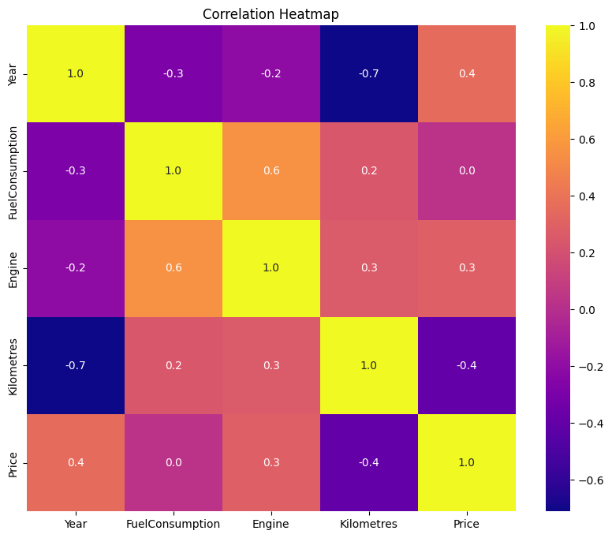
    


```python
ds = pd.read_csv('cleaneddata.csv')

```


```python
ds.dropna(subset=['Year', 'Engine', 'FuelConsumption', 'Kilometres', 'Price'], inplace=True)

```


```python
ds['Year'] = pd.to_numeric(ds['Year'], errors='coerce')
ds['Engine'] = pd.to_numeric(ds['Engine'], errors='coerce')
ds['FuelConsumption'] = pd.to_numeric(ds['FuelConsumption'], errors='coerce')
ds['Kilometres'] = pd.to_numeric(ds['Kilometres'], errors='coerce')
ds['Price'] = pd.to_numeric(ds['Price'], errors='coerce')

```


```python
from sklearn.preprocessing import LabelEncoder

# Perform label encoding for 'Brand'
if 'Brand' in ds.columns:
    LE = LabelEncoder()
    ds['Brand'] = LE.fit_transform(ds['Brand'])

# One-hot encoding for specified categorical columns
cat_cols = ['UsedOrNew', 'Transmission', 'DriveType', 'FuelType', 'BodyType']
for col in cat_cols:
    if col in ds.columns:
        dummies = pd.get_dummies(ds[col], prefix=col).astype(int)
        ds = pd.concat([ds, dummies], axis=1)

# Display the updated dataset
print("Dataset after one-hot encoding:")
print(ds.head())
```

    Dataset after one-hot encoding:
       Brand  Year   Model               Car/Suv  \
    0     60  2022  Rexton  Sutherland Isuzu Ute   
    1     41  2022     MG3             Hatchback   
    2      4  2022    430I                 Coupe   
    3     46  2011    E500                 Coupe   
    4     55  2022  Arkana                   SUV   
    
                                           Title UsedOrNew Transmission  Engine  \
    0       2022 Ssangyong Rexton Ultimate (awd)      DEMO    Automatic     2.2   
    1  2022 MG MG3 Auto Excite (with Navigation)      USED    Automatic     1.5   
    2                      2022 BMW 430I M Sport      USED    Automatic     2.0   
    3           2011 Mercedes-Benz E500 Elegance      USED    Automatic     5.5   
    4                 2022 Renault Arkana Intens      USED    Automatic     1.3   
    
      CylindersinEngine DriveType  ... BodyType_Convertible  BodyType_Coupe  \
    0                 4       AWD  ...                    0               0   
    1                 4     Front  ...                    0               0   
    2                 4      Rear  ...                    0               1   
    3                 8      Rear  ...                    0               1   
    4                 4     Front  ...                    0               0   
    
       BodyType_Hatchback BodyType_People Mover BodyType_SUV BodyType_Sedan  \
    0                   0                     0            1              0   
    1                   1                     0            0              0   
    2                   0                     0            0              0   
    3                   0                     0            0              0   
    4                   0                     0            1              0   
    
       BodyType_Truck  BodyType_UTE  BodyType_Van  BodyType_Wagon  
    0               0             0             0               0  
    1               0             0             0               0  
    2               0             0             0               0  
    3               0             0             0               0  
    4               0             0             0               0  
    
    [5 rows x 45 columns]
    


```python
def remove_outliers_iqr(data, columns):
    for col in columns:
        Q1 = data[col].quantile(0.25)
        Q3 = data[col].quantile(0.75)
        IQR = Q3 - Q1
        lower_bound = Q1 - 1.5 * IQR
        upper_bound = Q3 + 1.5 * IQR
        data = data[(data[col] >= lower_bound) & (data[col] <= upper_bound)]
    return data

numeric_columns = ['Kilometres', 'Engine', 'FuelConsumption', 'Price']
ds_cleaned = remove_outliers_iqr(ds, numeric_columns)

```


```python
from sklearn.model_selection import train_test_split

X = ds_cleaned.drop(['Price'], axis=1)
y = ds_cleaned['Price']

X_train, X_test, y_train, y_test = train_test_split(X, y, test_size=0.2, random_state=42)

```


```python
non_numeric_columns = X_train.select_dtypes(include=['object']).columns
print("Non-numeric columns:", non_numeric_columns)

```

    Non-numeric columns: Index(['Model', 'Car/Suv', 'Title', 'UsedOrNew', 'Transmission',
           'CylindersinEngine', 'DriveType', 'FuelType', 'Location', 'States',
           'BodyType'],
          dtype='object')
    


```python
if len(non_numeric_columns) > 0:
    X_train = pd.get_dummies(X_train, columns=non_numeric_columns, drop_first=True)
    X_test = pd.get_dummies(X_test, columns=non_numeric_columns, drop_first=True)
```


```python
X_train.dropna(inplace=True)
X_test.dropna(inplace=True)

```


```python

from scipy.stats import zscore, shapiro
import statsmodels.api as sm

# Define a function to remove outliers using the IQR method
def remove_outliers_iqr(data, columns):
    """
    Removes rows with outliers in the specified columns based on the IQR method.

    Parameters:
        data (DataFrame): The input DataFrame.
        columns (list): List of column names to check for outliers.

    Returns:
        DataFrame: The DataFrame with outliers removed.
    """
    for col in columns:
        if col in data.columns:
            # Ensure the column is numeric
            data[col] = pd.to_numeric(data[col], errors='coerce')
            Q1 = data[col].quantile(0.25)
            Q3 = data[col].quantile(0.75)
            IQR = Q3 - Q1
            lower_bound = Q1 - 1.5 * IQR
            upper_bound = Q3 + 1.5 * IQR
            data = data[(data[col] >= lower_bound) & (data[col] <= upper_bound)]
    return data

# Specify columns to check for outliers
columns_to_check = ['Kilometres', 'Engine', 'FuelConsumption', 'Price']

# Ensure all columns are numeric before applying the IQR method
for col in columns_to_check:
    if col in ds.columns:
        ds[col] = pd.to_numeric(ds[col], errors='coerce')

# Remove outliers using the IQR method
cleaned_data = remove_outliers_iqr(ds, columns_to_check)

# Display the cleaned dataset
print("Original Data Shape:", ds.shape)
print("Cleaned Data Shape (IQR Method):", cleaned_data.shape)

# Select numeric columns for correlation analysis
relevant_columns = ['Year', 'FuelConsumption', 'Engine', 'Kilometres', 'Price']
data_for_corr = cleaned_data[relevant_columns].dropna()


```

    Original Data Shape: (14893, 45)
    Cleaned Data Shape (IQR Method): (12550, 45)
    

    C:\Users\Lenovo\AppData\Local\Temp\ipykernel_18888\257861330.py:19: SettingWithCopyWarning: 
    A value is trying to be set on a copy of a slice from a DataFrame.
    Try using .loc[row_indexer,col_indexer] = value instead
    
    See the caveats in the documentation: https://pandas.pydata.org/pandas-docs/stable/user_guide/indexing.html#returning-a-view-versus-a-copy
      data[col] = pd.to_numeric(data[col], errors='coerce')
    


```python
from scipy.stats import zscore, shapiro
import statsmodels.api as sm
import matplotlib.pyplot as plt
import seaborn as sns
import pandas as pd

# Ensure data is numeric, coercing errors to NaN
relevant_columns = ['Kilometres', 'Engine', 'FuelConsumption', 'Price']
data = ds[relevant_columns].apply(pd.to_numeric, errors='coerce')

# Drop rows with missing or invalid data
data = data.dropna()

# Function to check for outliers using Z-score
def check_outliers_zscore(df, threshold=3):
    outliers = {}
    for col in df.columns:
        z_scores = zscore(df[col])
        outliers[col] = df[(z_scores > threshold) | (z_scores < -threshold)].shape[0]
    return outliers

# Function to visualize outliers with plasma colormap
def plot_boxplots(df):
    plasma_cmap = sns.color_palette("plasma", len(df.columns))
    for i, col in enumerate(df.columns):
        plt.figure(figsize=(6, 4))
        sns.boxplot(x=df[col], color=plasma_cmap[i])
        plt.title(f"Boxplot of {col}", color=plasma_cmap[i])
        plt.show()

# Function to check residual normality (Shapiro-Wilk test)
def check_residual_normality(residuals):
    stat, p_value = shapiro(residuals)
    print("Shapiro-Wilk Test for Normality:")
    print(f"Statistic: {stat}, P-value: {p_value}")
    if p_value > 0.05:
        print("Residuals appear to be normally distributed.")
    else:
        print("Residuals do not appear to be normally distributed.")

# Function to calculate Variance Inflation Factor (VIF)
def calculate_vif(df):
    vif_data = pd.DataFrame()
    vif_data["Feature"] = df.columns
    vif_data["VIF"] = [
        1 / (1 - sm.OLS(df[col], sm.add_constant(df.drop(columns=[col]))).fit().rsquared)
        for col in df.columns
    ]
    return vif_data

# Drop the target column 'Price' from the features for VIF calculation
features = data.drop(columns=['Price'])

# Check and calculate VIF
vif_results = calculate_vif(features)
print("Variance Inflation Factor (VIF):")
print(vif_results)

# Outlier detection
outliers = check_outliers_zscore(data)
print("Outliers in each column (Z-Score Method):")
print(outliers)

# Plot boxplots to visualize outliers with plasma colormap
plot_boxplots(data)

# Example Linear Regression Residual Analysis
X = data[['Kilometres', 'Engine', 'FuelConsumption']]
X = sm.add_constant(X)  # Add constant for intercept
Y = data['Price']
model = sm.OLS(Y, X).fit()
residuals = model.resid

# Check residual normality
check_residual_normality(residuals)

# Plot residuals with plasma colormap
plt.figure(figsize=(6, 4))
sns.scatterplot(x=model.fittedvalues, y=residuals, color=sns.color_palette("plasma", 10)[5])
plt.axhline(0, color= 'black', linestyle='--')
plt.title("Residuals vs Fitted Values", color=sns.color_palette("plasma", 10)[7])
plt.xlabel("Fitted Values")
plt.ylabel("Residuals")
plt.grid()
plt.show()

```

    Variance Inflation Factor (VIF):
               Feature       VIF
    0       Kilometres  1.077397
    1           Engine  1.699562
    2  FuelConsumption  1.678795
    Outliers in each column (Z-Score Method):
    {'Kilometres': 127, 'Engine': 266, 'FuelConsumption': 314, 'Price': 208}
    


    
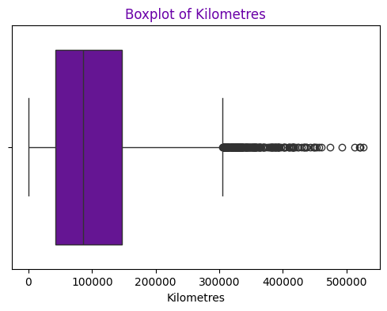
    


    
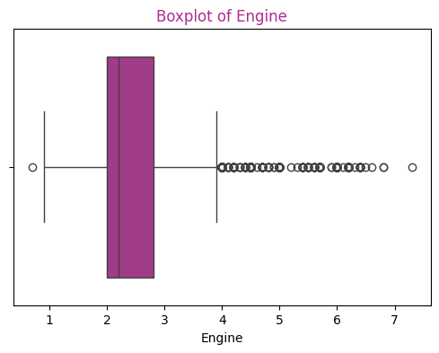
    


    
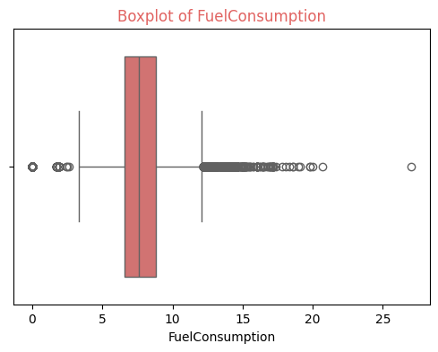
    


    
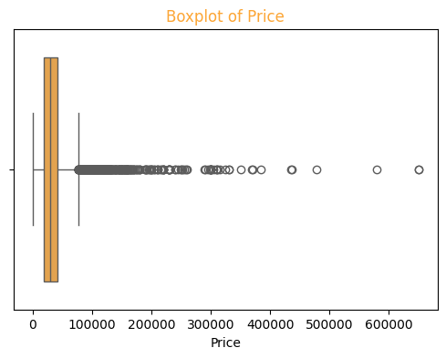
    


    Shapiro-Wilk Test for Normality:
    Statistic: 0.6460109125263298, P-value: 1.6343811843257495e-98
    Residuals do not appear to be normally distributed.
    

    c:\Users\Lenovo\Documents\Aiden_Portfolio\Auscar\venv\Lib\site-packages\scipy\stats\_axis_nan_policy.py:586: UserWarning: scipy.stats.shapiro: For N > 5000, computed p-value may not be accurate. Current N is 14364.
      res = hypotest_fun_out(*samples, **kwds)
    


    
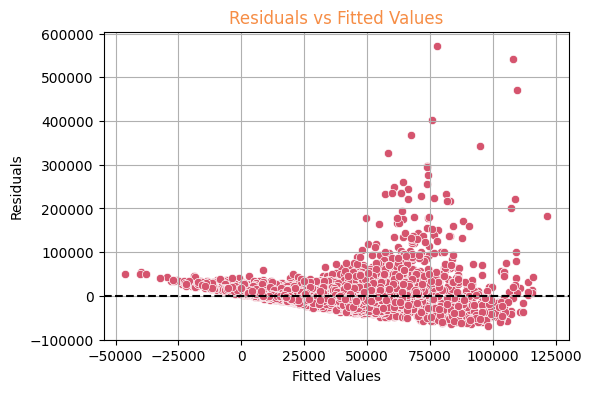
    


```python
from sklearn.utils.validation import check_X_y
from sklearn.ensemble import RandomForestRegressor

# Ensure feature columns and target variable have the same number of rows
X = X.dropna()
y = y.dropna()

# Align X and y after dropping missing values
X, y = X.align(y, join='inner', axis=0)

# Identify non-numeric columns
non_numeric_columns = X.select_dtypes(include=['object']).columns.tolist()

if len(non_numeric_columns) > 0:
    print("Non-numeric columns detected:", non_numeric_columns)
    print(X[non_numeric_columns].head())  # View the first few rows

    # Option 1: Drop non-numeric columns if unnecessary
    X = X.drop(columns=non_numeric_columns, errors='ignore')

    # Option 2: Encode non-numeric columns if needed
    for col in non_numeric_columns:
        if col in X.columns:  # Check if column exists before processing
            if X[col].nunique() <= 10:  # Few unique values, use one-hot encoding
                dummies = pd.get_dummies(X[col], prefix=col, drop_first=True)
                X = pd.concat([X.reset_index(drop=True), dummies.reset_index(drop=True)], axis=1)
            else:  # Many unique values, use label encoding
                le = LabelEncoder()
                X[col] = le.fit_transform(X[col])

# Ensure all columns are numeric
if len(X.select_dtypes(include=['object']).columns) > 0:
    raise ValueError("There are still non-numeric columns in the dataset. Please review them.")

# Check consistency of X and y
assert len(X) == len(y), f"Mismatch in number of samples: X ({len(X)}), y ({len(y)})"

# Fit Random Forest model
rf = RandomForestRegressor(random_state=42)
rf.fit(X, y)

# Feature importance
feature_importance = pd.DataFrame({'Feature': X.columns, 'Importance': rf.feature_importances_})
feature_importance.sort_values(by='Importance', ascending=False, inplace=True)
print(feature_importance)

# Plot feature importance
plt.figure(figsize=(10, 6))
sns.barplot(x='Importance', y='Feature', data=feature_importance, palette='plasma')
plt.title("Feature Importance from Random Forest")
plt.xlabel("Importance")
plt.ylabel("Feature")
plt.tight_layout()
plt.show()
```

               Feature  Importance
    1       Kilometres    0.587852
    2           Engine    0.220128
    3  FuelConsumption    0.192019
    0            const    0.000000
    

    C:\Users\Lenovo\AppData\Local\Temp\ipykernel_18888\554971062.py:49: FutureWarning: 
    
    Passing `palette` without assigning `hue` is deprecated and will be removed in v0.14.0. Assign the `y` variable to `hue` and set `legend=False` for the same effect.
    
      sns.barplot(x='Importance', y='Feature', data=feature_importance, palette='plasma')
    


    
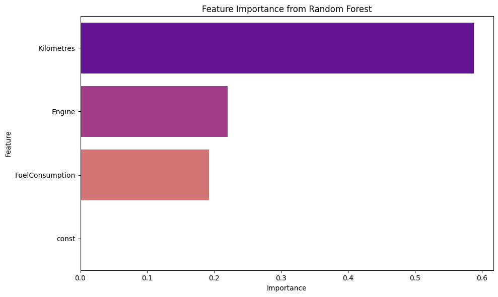
    


```python
ds = ds.dropna(subset=['Price'])

```


```python
cleaned_data = remove_outliers_iqr(ds, columns_to_check)
print("After outlier removal:", cleaned_data.shape)
```

    After outlier removal: (12550, 45)
    

    C:\Users\Lenovo\AppData\Local\Temp\ipykernel_18888\257861330.py:19: SettingWithCopyWarning: 
    A value is trying to be set on a copy of a slice from a DataFrame.
    Try using .loc[row_indexer,col_indexer] = value instead
    
    See the caveats in the documentation: https://pandas.pydata.org/pandas-docs/stable/user_guide/indexing.html#returning-a-view-versus-a-copy
      data[col] = pd.to_numeric(data[col], errors='coerce')
    


```python
# Ensure numeric data and remove any missing values
X = X.apply(pd.to_numeric, errors='coerce')

# Combine X and y to ensure alignment when removing missing values
data = pd.concat([X, y], axis=1)

# Drop rows with missing values
data.dropna(inplace=True)

# Separate the cleaned features and target variable
X = data.drop(columns=['Price'])  # Ensure 'Price' is the correct target variable
y = data['Price']

# Split the data
X_train, X_test, y_train, y_test = train_test_split(X, y, test_size=0.2, random_state=42)

print("X shape:", X.shape)
print("y shape:", y.shape)

```

    X shape: (12550, 4)
    y shape: (12550,)
    


```python
from sklearn.linear_model import LinearRegression, Lasso, Ridge, ElasticNet
from sklearn.metrics import mean_absolute_error, mean_squared_error, r2_score
from sklearn.preprocessing import StandardScaler

# Ensure numeric data and remove any missing values
X = X.apply(pd.to_numeric, errors='coerce')
X.dropna(inplace=True)

# Split the data
X_train, X_test, y_train, y_test = train_test_split(X, y, test_size=0.2, random_state=42)

# Standardize the features
scaler = StandardScaler()
X_train_scaled = scaler.fit_transform(X_train)
X_test_scaled = scaler.transform(X_test)

# Define models
models = {
    "Linear Regression": LinearRegression(),
    "Lasso Regression": Lasso(alpha=1.0),
    "Ridge Regression": Ridge(alpha=1.0),
    "ElasticNet Regression": ElasticNet(alpha=1.0, l1_ratio=0.5)
}

# Train and evaluate models
results = {}
for name, model in models.items():
    model.fit(X_train_scaled, y_train)
    y_pred = model.predict(X_test_scaled)

    mae = mean_absolute_error(y_test, y_pred)
    mse = mean_squared_error(y_test, y_pred)
    r2 = r2_score(y_test, y_pred)

    results[name] = {
        "MAE": mae,
        "MSE": mse,
        "R2 Score": r2
    }

    print(f"--- {name} ---")
    print(f"MAE: {mae:.2f}")
    print(f"MSE: {mse:.2f}")
    print(f"R2 Score: {r2:.2f}")
    print("-------------------------------")

# Compare model performance visually
results_df = pd.DataFrame(results).T

# Generate a color palette from the plasma colormap with 10 discrete colors
custom_cmap = sns.color_palette("plasma", 10)  # Generates 10 colors from plasma colormap

# Plot Model MAE Comparison
plt.figure(figsize=(10, 5))
sns.barplot(x=results_df.index, y=results_df['MAE'], hue=results_df.index, palette=custom_cmap, legend=False)
plt.title("Model MAE Comparison")
plt.ylabel("MAE")
plt.xlabel("Regression Model")
plt.grid(axis='y', linestyle='--')
plt.show()

# Plot Model MSE Comparison
plt.figure(figsize=(10, 5))
sns.barplot(x=results_df.index, y=results_df['MSE'], hue=results_df.index, palette=custom_cmap, legend=False)
plt.title("Model MSE Comparison")
plt.ylabel("MSE")
plt.xlabel("Regression Model")
plt.grid(axis='y', linestyle='--')
plt.show()

# Plot Model R2 Score Comparison
plt.figure(figsize=(10, 5))
sns.barplot(x=results_df.index, y=results_df['R2 Score'], hue=results_df.index, palette=custom_cmap, legend=False)
plt.title("Model R2 Score Comparison")
plt.ylabel("R2 Score")
plt.xlabel("Regression Model")
plt.grid(axis='y', linestyle='--')
plt.show()

```

    --- Linear Regression ---
    MAE: 8314.42
    MSE: 111816983.58
    R2 Score: 0.50
    -------------------------------
    --- Lasso Regression ---
    MAE: 8314.42
    MSE: 111817072.93
    R2 Score: 0.50
    -------------------------------
    --- Ridge Regression ---
    MAE: 8314.41
    MSE: 111816810.40
    R2 Score: 0.50
    -------------------------------
    --- ElasticNet Regression ---
    MAE: 9156.69
    MSE: 131625221.11
    R2 Score: 0.41
    -------------------------------
    

    C:\Users\Lenovo\AppData\Local\Temp\ipykernel_18888\3007874775.py:55: UserWarning: The palette list has more values (10) than needed (4), which may not be intended.
      sns.barplot(x=results_df.index, y=results_df['MAE'], hue=results_df.index, palette=custom_cmap, legend=False)
    


    
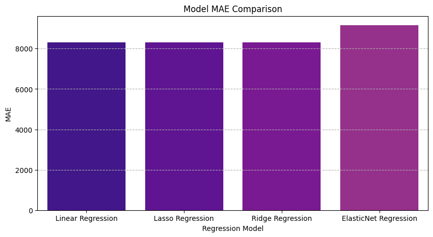
    


    C:\Users\Lenovo\AppData\Local\Temp\ipykernel_18888\3007874775.py:64: UserWarning: The palette list has more values (10) than needed (4), which may not be intended.
      sns.barplot(x=results_df.index, y=results_df['MSE'], hue=results_df.index, palette=custom_cmap, legend=False)
    


    
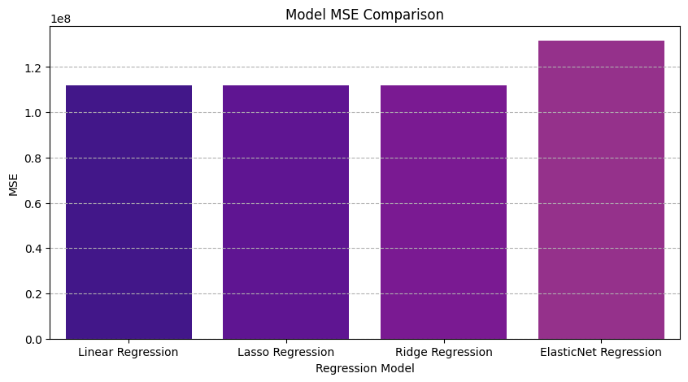
    


    C:\Users\Lenovo\AppData\Local\Temp\ipykernel_18888\3007874775.py:73: UserWarning: The palette list has more values (10) than needed (4), which may not be intended.
      sns.barplot(x=results_df.index, y=results_df['R2 Score'], hue=results_df.index, palette=custom_cmap, legend=False)
    


    
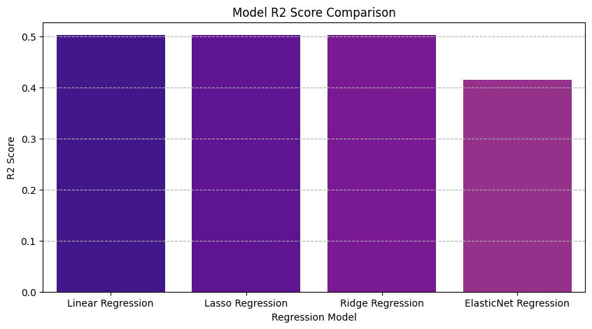
    


```python
from sklearn.model_selection import GridSearchCV

# Define hyperparameter grids for each model
param_grid_ridge = {
    'alpha': [0.01, 0.1, 1, 10, 100]
}

param_grid_lasso = {
    'alpha': [0.01, 0.1, 1, 10, 100]
}

param_grid_elasticnet = {
    'alpha': [0.01, 0.1, 1, 10, 100],
    'l1_ratio': [0.1, 0.5, 0.9]
}

# Initialize models
ridge = Ridge()
lasso = Lasso()
elastic_net = ElasticNet()

# Perform GridSearchCV for Ridge Regression
ridge_search = GridSearchCV(ridge, param_grid_ridge, cv=5, scoring='r2', n_jobs=-1)
ridge_search.fit(X_train_scaled, y_train)

# Perform GridSearchCV for Lasso Regression
lasso_search = GridSearchCV(lasso, param_grid_lasso, cv=5, scoring='r2', n_jobs=-1)
lasso_search.fit(X_train_scaled, y_train)

# Perform GridSearchCV for ElasticNet Regression
elasticnet_search = GridSearchCV(elastic_net, param_grid_elasticnet, cv=5, scoring='r2', n_jobs=-1)
elasticnet_search.fit(X_train_scaled, y_train)

# Display the best parameters and R2 scores
print("Best Ridge Regression Parameters:", ridge_search.best_params_)
print("Best Ridge R2 Score:", ridge_search.best_score_)

print("Best Lasso Regression Parameters:", lasso_search.best_params_)
print("Best Lasso R2 Score:", lasso_search.best_score_)

print("Best ElasticNet Regression Parameters:", elasticnet_search.best_params_)
print("Best ElasticNet R2 Score:", elasticnet_search.best_score_)

```

    Best Ridge Regression Parameters: {'alpha': 1}
    Best Ridge R2 Score: 0.5092140461324204
    Best Lasso Regression Parameters: {'alpha': 1}
    Best Lasso R2 Score: 0.5092139960159485
    Best ElasticNet Regression Parameters: {'alpha': 0.01, 'l1_ratio': 0.9}
    Best ElasticNet R2 Score: 0.5092140260635506
    


```python
from sklearn.tree import DecisionTreeRegressor
from sklearn.ensemble import RandomForestRegressor, GradientBoostingRegressor
from sklearn.svm import SVR

# Define non-linear models
non_linear_models = {
    "Decision Tree": DecisionTreeRegressor(max_depth=10, random_state=42),
    "Random Forest": RandomForestRegressor(n_estimators=100, max_depth=10, random_state=42),
    "Gradient Boosting": GradientBoostingRegressor(n_estimators=100, learning_rate=0.1, max_depth=5, random_state=42)
}

# Train and evaluate non-linear models
non_linear_results = {}
for name, model in non_linear_models.items():
    model.fit(X_train_scaled, y_train)
    y_pred = model.predict(X_test_scaled)

    mae = mean_absolute_error(y_test, y_pred)
    mse = mean_squared_error(y_test, y_pred)
    r2 = r2_score(y_test, y_pred)

    non_linear_results[name] = {
        "MAE": mae,
        "MSE": mse,
        "R2 Score": r2
    }

    print(f"--- {name} ---")
    print(f"MAE: {mae:.2f}")
    print(f"MSE: {mse:.2f}")
    print(f"R2 Score: {r2:.2f}")
    print("-------------------------------")

# Convert results to DataFrame and visualize
non_linear_results_df = pd.DataFrame(non_linear_results).T

# Plot results
plt.figure(figsize=(10, 5))
sns.barplot(x=non_linear_results_df.index, y=non_linear_results_df['R2 Score'], hue=non_linear_results_df.index, palette='plasma', legend=False)
plt.title("Non-Linear Regression Model R2 Score Comparison")
plt.ylabel("R2 Score")
plt.xlabel("Model")
plt.grid(axis='y', linestyle='--')
plt.show()

# Scatter plot for predicted vs actual values
plt.figure(figsize=(8, 6))
colors = sns.color_palette("plasma", len(non_linear_models))

for (name, model), color in zip(non_linear_models.items(), colors):
    y_pred = model.predict(X_test_scaled)
    plt.scatter(y_test, y_pred, alpha=0.6, label=name, color=color)

plt.plot([min(y_test), max(y_test)], [min(y_test), max(y_test)], color='black', linestyle='--')
plt.xlabel("Actual Prices")
plt.ylabel("Predicted Prices")
plt.title("Predicted vs Actual Prices for Non-Linear Models")
plt.legend()
plt.grid()
plt.show()

# Residual distribution plot using plasma colormap
plt.figure(figsize=(8, 6))

for (name, model), color in zip(non_linear_models.items(), colors):
    y_pred = model.predict(X_test_scaled)
    residuals = y_test - y_pred
    sns.histplot(residuals, kde=True, label=name, alpha=0.6, color=color)

plt.title("Residual Distribution for Non-Linear Models")
plt.xlabel("Residuals")
plt.legend()
plt.grid()
plt.show()
```

    --- Decision Tree ---
    MAE: 6643.23
    MSE: 84294397.58
    R2 Score: 0.62
    -------------------------------
    --- Random Forest ---
    MAE: 6089.18
    MSE: 68987007.68
    R2 Score: 0.69
    -------------------------------
    --- Gradient Boosting ---
    MAE: 6159.28
    MSE: 68716290.29
    R2 Score: 0.69
    -------------------------------
    


    
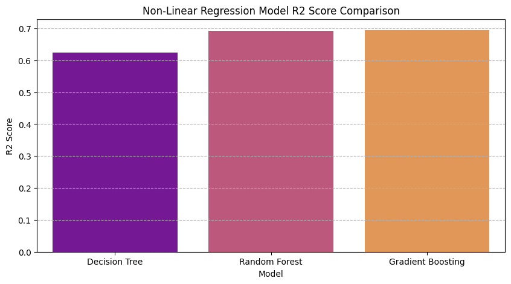
    


    
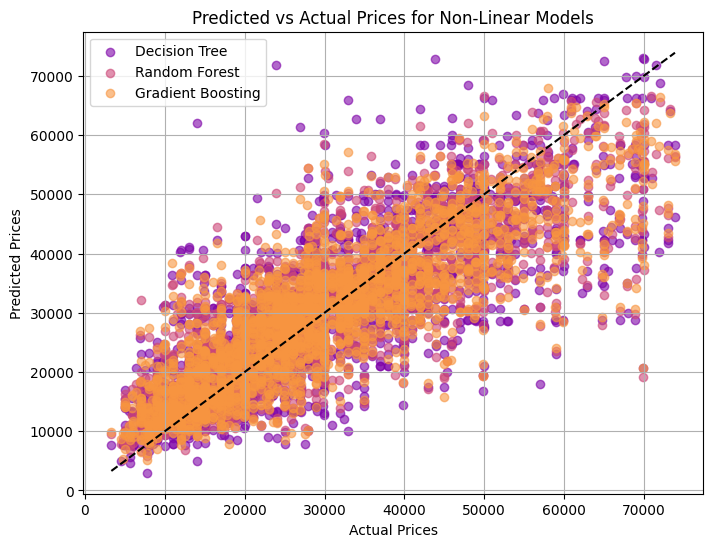
    


    
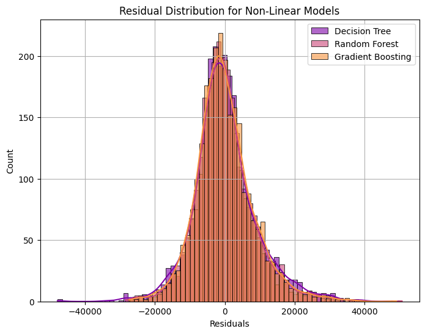
    


```python
# Define feature columns and target variable
feature_columns = ['Year', 'Kilometres', 'Engine', 'FuelConsumption', 'Brand']
X = cleaned_data[feature_columns]
y = cleaned_data['Price']

# Split the data
X_train, X_test, y_train, y_test = train_test_split(X, y, test_size=0.2, random_state=42)

# Standardize the features
scaler = StandardScaler()
X_train_scaled = scaler.fit_transform(X_train)
X_test_scaled = scaler.transform(X_test)

# Define parameter grid for Random Forest
rf_param_grid = {
    'n_estimators': [50, 100, 150, 500],
    'max_depth': [5, 10, 20, 30, 50],
    'min_samples_split': [2, 5, 10],
    'min_samples_leaf': [1, 2, 4]
}

# Define parameter grid for Gradient Boosting
gb_param_grid = {
    'n_estimators': [50, 100, 150, 500],
    'learning_rate': [0.01, 0.1, 0.2],
    'max_depth': [3, 5, 7, 10],
    'subsample': [0.8, 1.0]
}

# Hyperparameter tuning for Random Forest
rf = RandomForestRegressor(random_state=42)
rf_grid_search = GridSearchCV(rf, rf_param_grid, cv=5, scoring='r2', n_jobs=-1)
rf_grid_search.fit(X_train_scaled, y_train)
best_rf = rf_grid_search.best_estimator_
print("Best Random Forest Parameters:", rf_grid_search.best_params_)
print("Best Random Forest R2 Score:", rf_grid_search.best_score_)

# Hyperparameter tuning for Gradient Boosting
gb = GradientBoostingRegressor(random_state=42)
gb_grid_search = GridSearchCV(gb, gb_param_grid, cv=5, scoring='r2', n_jobs=-1)
gb_grid_search.fit(X_train_scaled, y_train)
best_gb = gb_grid_search.best_estimator_
print("Best Gradient Boosting Parameters:", gb_grid_search.best_params_)
print("Best Gradient Boosting R2 Score:", gb_grid_search.best_score_)

# Evaluate the tuned models
y_pred_rf = best_rf.predict(X_test_scaled)
y_pred_gb = best_gb.predict(X_test_scaled)
y_pred_dt = DecisionTreeRegressor(max_depth=10, random_state=42).fit(X_train_scaled, y_train).predict(X_test_scaled)

cmap = plt.get_cmap("plasma")
colors = [cmap(0.2), cmap(0.5), cmap(0.8)]  # Choosing 3 distinct colors from plasma colormap

# Plot predicted vs actuall
plt.figure(figsize=(8, 6))
plt.scatter(y_test, y_pred_rf, color=colors[0], alpha=0.6, label='Random Forest')
plt.scatter(y_test, y_pred_gb, color=colors[1], alpha=0.6, label='Gradient Boosting')
plt.scatter(y_test, y_pred_dt, color=colors[2], alpha=0.6, label='Decision Tree')

# Reference line
plt.plot([min(y_test), max(y_test)], [min(y_test), max(y_test)], color='black', lw=2, linestyle='--')

plt.xlabel("Actual Prices")
plt.ylabel("Predicted Prices")
plt.title("Predicted vs Actual Prices (Plasma Colormap)")
plt.legend()
plt.grid()
plt.show()

# Residual plots
residuals_rf = y_test - y_pred_rf
residuals_gb = y_test - y_pred_gb
residuals_dt = y_test - y_pred_dt

plt.figure(figsize=(8, 6))
sns.histplot(residuals_rf, kde=True, color=colors[0], label='Random Forest Residuals')
sns.histplot(residuals_gb, kde=True, color=colors[1], label='Gradient Boosting Residuals')
sns.histplot(residuals_dt, kde=True, color=colors[2], label='Decision Tree Residuals')

plt.title("Residual Distribution (Plasma Colormap)")
plt.xlabel("Residuals")
plt.legend()
plt.grid()
plt.show()

# Print evaluation metrics
print("Random Forest Regression Metrics:")
print(f"MAE: {mean_absolute_error(y_test, y_pred_rf):.2f}")
print(f"MSE: {mean_squared_error(y_test, y_pred_rf):.2f}")
print(f"R² Score: {r2_score(y_test, y_pred_rf):.2f}")

print("\nGradient Boosting Regression Metrics:")
print(f"MAE: {mean_absolute_error(y_test, y_pred_gb):.2f}")
print(f"MSE: {mean_squared_error(y_test, y_pred_gb):.2f}")
print(f"R² Score: {r2_score(y_test, y_pred_gb):.2f}")

print("\nDecision Tree Regression Metrics:")
print(f"MAE: {mean_absolute_error(y_test, y_pred_dt):.2f}")
print(f"MSE: {mean_squared_error(y_test, y_pred_dt):.2f}")
print(f"R² Score: {r2_score(y_test, y_pred_dt):.2f}")
```

    Best Random Forest Parameters: {'max_depth': 20, 'min_samples_leaf': 1, 'min_samples_split': 5, 'n_estimators': 500}
    Best Random Forest R2 Score: 0.8711870416728089
    Best Gradient Boosting Parameters: {'learning_rate': 0.1, 'max_depth': 7, 'n_estimators': 500, 'subsample': 0.8}
    Best Gradient Boosting R2 Score: 0.8931214990864003
    


    
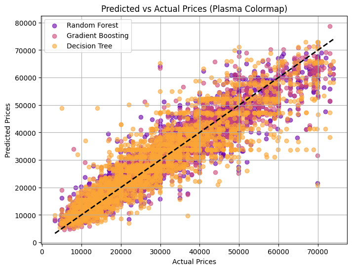
    


    
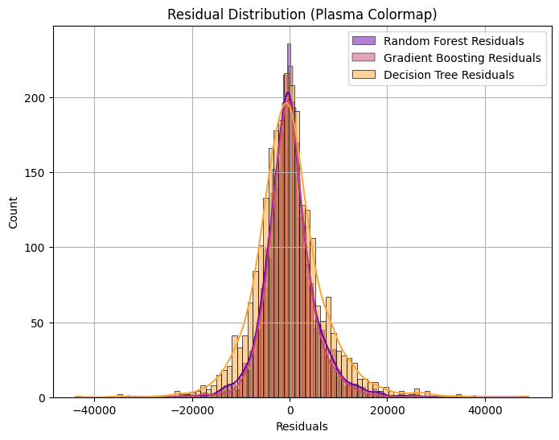
    


    Random Forest Regression Metrics:
    MAE: 3684.26
    MSE: 27656611.43
    R² Score: 0.88
    
    Gradient Boosting Regression Metrics:
    MAE: 3412.15
    MSE: 23121459.20
    R² Score: 0.90
    
    Decision Tree Regression Metrics:
    MAE: 5146.04
    MSE: 51748071.00
    R² Score: 0.77
    


```python
import pandas as pd
import numpy as np
import matplotlib.pyplot as plt
from sklearn.model_selection import train_test_split
from sklearn.preprocessing import StandardScaler, OneHotEncoder
from sklearn.metrics import mean_absolute_error, mean_squared_error, r2_score
from xgboost import XGBRegressor
from lightgbm import LGBMRegressor

# Define feature columns and target variable
feature_columns = ['Year', 'Kilometres', 'Engine', 'FuelConsumption', 'BodyType','Brand']
X = cleaned_data[feature_columns]
y = cleaned_data['Price']

# Drop rows with missing target variable or features
X = X.dropna(subset=feature_columns)
y = y.dropna()

# One-hot encode the categorical feature 'BodyType'
encoder = OneHotEncoder(drop='first', sparse_output=False)
bodytype_encoded = encoder.fit_transform(X[['BodyType']])
bodytype_encoded_df = pd.DataFrame(bodytype_encoded, columns=encoder.get_feature_names_out(['BodyType']))

# Drop the original categorical column and merge the encoded data
X = X.drop(columns=['BodyType'])
X = pd.concat([X.reset_index(drop=True), bodytype_encoded_df.reset_index(drop=True)], axis=1)

# Split the data
X_train, X_test, y_train, y_test = train_test_split(X, y, test_size=0.2, random_state=42)

# Standardize the numerical features
scaler = StandardScaler()
X_train_scaled = scaler.fit_transform(X_train)
X_test_scaled = scaler.transform(X_test)

# Train XGBoost model
xgb_model = XGBRegressor(
    objective='reg:squarederror',
    n_estimators=200,
    max_depth=7,
    learning_rate=0.1,
    subsample=0.8,
    random_state=42
)
xgb_model.fit(X_train_scaled, y_train)

# Train LightGBM model
lgb_model = LGBMRegressor(
    n_estimators=200,
    max_depth=7,
    learning_rate=0.1,
    num_leaves=31,
    random_state=42
)
lgb_model.fit(X_train_scaled, y_train)

# Evaluate the models
y_pred_xgb = xgb_model.predict(X_test_scaled)
y_pred_lgb = lgb_model.predict(X_test_scaled)

def evaluate_model(model_name, y_test, y_pred):
    mae = mean_absolute_error(y_test, y_pred)
    mse = mean_squared_error(y_test, y_pred)
    r2 = r2_score(y_test, y_pred)

    print(f"--- {model_name} ---")
    print(f"MAE: {mae:.2f}")
    print(f"MSE: {mse:.2f}")
    print(f"R² Score: {r2:.2f}")
    print("-------------------------------")

# Print the evaluation results
evaluate_model("XGBoost", y_test, y_pred_xgb)
evaluate_model("LightGBM", y_test, y_pred_lgb)
```

    [LightGBM] [Info] Auto-choosing row-wise multi-threading, the overhead of testing was 0.000213 seconds.
    You can set `force_row_wise=true` to remove the overhead.
    And if memory is not enough, you can set `force_col_wise=true`.
    [LightGBM] [Info] Total Bins 453
    [LightGBM] [Info] Number of data points in the train set: 10040, number of used features: 12
    [LightGBM] [Info] Start training from score 30230.842131
    [LightGBM] [Warning] No further splits with positive gain, best gain: -inf
    [LightGBM] [Warning] No further splits with positive gain, best gain: -inf
    [LightGBM] [Warning] No further splits with positive gain, best gain: -inf
    [LightGBM] [Warning] No further splits with positive gain, best gain: -inf
    [LightGBM] [Warning] No further splits with positive gain, best gain: -inf
    [LightGBM] [Warning] No further splits with positive gain, best gain: -inf
    [LightGBM] [Warning] No further splits with positive gain, best gain: -inf
    [LightGBM] [Warning] No further splits with positive gain, best gain: -inf
    [LightGBM] [Warning] No further splits with positive gain, best gain: -inf
    [LightGBM] [Warning] No further splits with positive gain, best gain: -inf
    [LightGBM] [Warning] No further splits with positive gain, best gain: -inf
    [LightGBM] [Warning] No further splits with positive gain, best gain: -inf
    [LightGBM] [Warning] No further splits with positive gain, best gain: -inf
    [LightGBM] [Warning] No further splits with positive gain, best gain: -inf
    [LightGBM] [Warning] No further splits with positive gain, best gain: -inf
    [LightGBM] [Warning] No further splits with positive gain, best gain: -inf
    [LightGBM] [Warning] No further splits with positive gain, best gain: -inf
    [LightGBM] [Warning] No further splits with positive gain, best gain: -inf
    [LightGBM] [Warning] No further splits with positive gain, best gain: -inf
    [LightGBM] [Warning] No further splits with positive gain, best gain: -inf
    [LightGBM] [Warning] No further splits with positive gain, best gain: -inf
    [LightGBM] [Warning] No further splits with positive gain, best gain: -inf
    [LightGBM] [Warning] No further splits with positive gain, best gain: -inf
    [LightGBM] [Warning] No further splits with positive gain, best gain: -inf
    --- XGBoost ---
    MAE: 3228.19
    MSE: 20543356.00
    R² Score: 0.91
    -------------------------------
    --- LightGBM ---
    MAE: 3427.65
    MSE: 22514402.09
    R² Score: 0.90
    -------------------------------
    

    c:\Users\Lenovo\Documents\Aiden_Portfolio\Auscar\venv\Lib\site-packages\sklearn\utils\deprecation.py:151: FutureWarning: 'force_all_finite' was renamed to 'ensure_all_finite' in 1.6 and will be removed in 1.8.
      warnings.warn(
    c:\Users\Lenovo\Documents\Aiden_Portfolio\Auscar\venv\Lib\site-packages\sklearn\utils\deprecation.py:151: FutureWarning: 'force_all_finite' was renamed to 'ensure_all_finite' in 1.6 and will be removed in 1.8.
      warnings.warn(
    


```python
import matplotlib.pyplot as plt

# Get distinct colors from the plasma colormap
cmap = get_cmap('plasma')
colors = [cmap(i) for i in np.linspace(0, 1, 8)]  # Get 4 distinct colors

# Plot predicted vs actual values
plt.figure(figsize=(8, 6))
plt.scatter(y_test, y_pred_xgb, color=colors[1], alpha=0.5, label='XGBoost')
plt.scatter(y_test, y_pred_lgb, color=colors[6], alpha=0.5, label='LightGBM')
plt.plot([min(y_test), max(y_test)], [min(y_test), max(y_test)], color='black', lw=2, linestyle='--')
plt.xlabel("Actual Prices")
plt.ylabel("Predicted Prices")
plt.title("Predicted vs Actual Prices")
plt.legend()
plt.grid()
plt.show()

# Plot residuals distribution
residuals_xgb = y_test - y_pred_xgb
residuals_lgb = y_test - y_pred_lgb

plt.figure(figsize=(8, 6))
sns.histplot(residuals_xgb, kde=True, color=colors[1], label='XGBoost Residuals', alpha=0.7)
sns.histplot(residuals_lgb, kde=True, color=colors[6], label='LightGBM Residuals', alpha=0.7)
plt.title("Residual Distribution")
plt.xlabel("Residuals")
plt.legend()
plt.grid()
plt.show()
```

    C:\Users\Lenovo\AppData\Local\Temp\ipykernel_18888\1428180344.py:4: MatplotlibDeprecationWarning: The get_cmap function was deprecated in Matplotlib 3.7 and will be removed in 3.11. Use ``matplotlib.colormaps[name]`` or ``matplotlib.colormaps.get_cmap()`` or ``pyplot.get_cmap()`` instead.
      cmap = get_cmap('plasma')
    


    
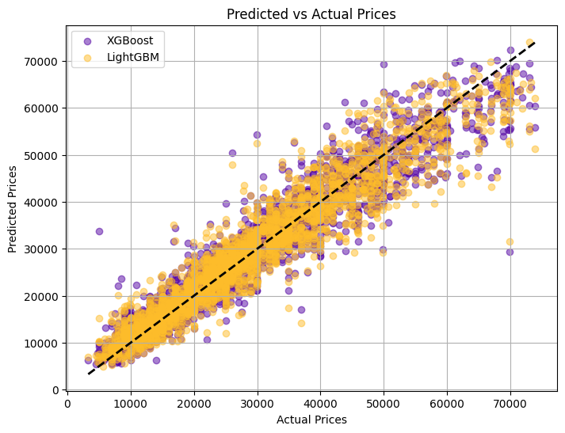
    


    
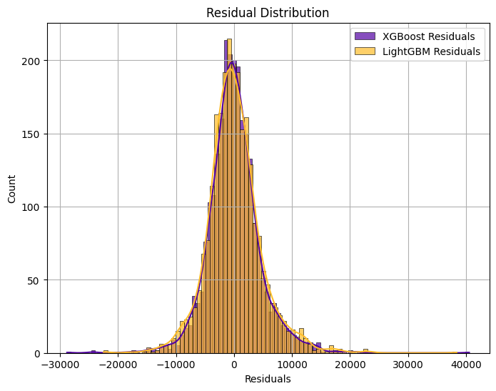
    

