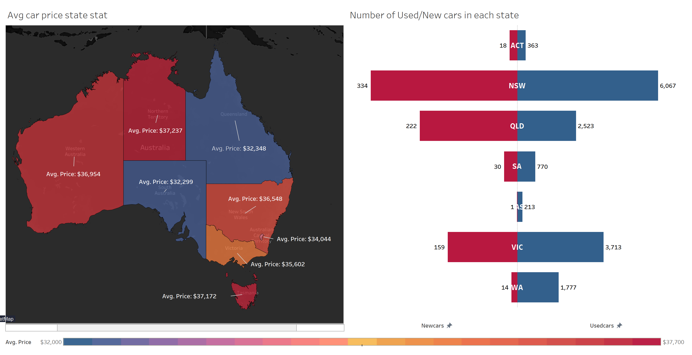
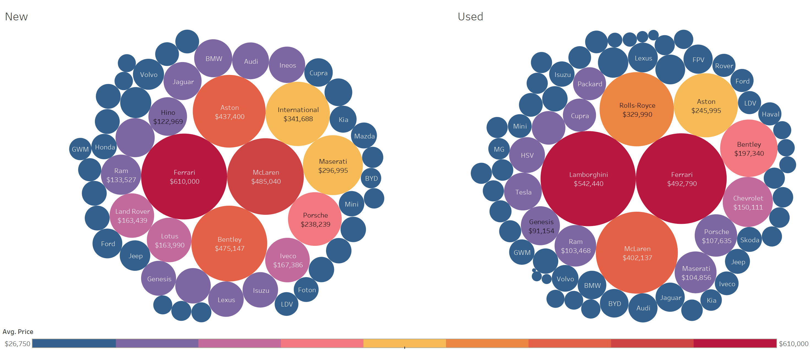
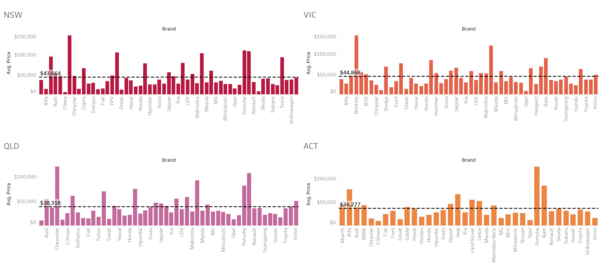
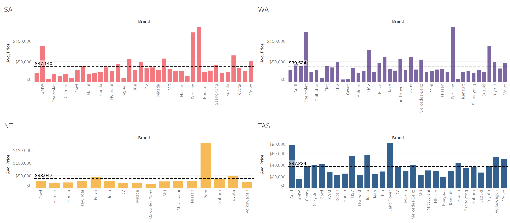
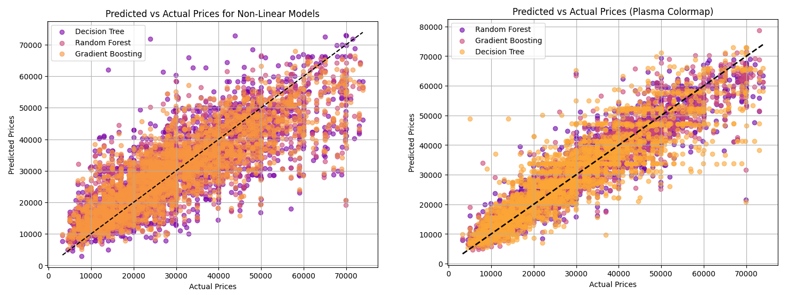
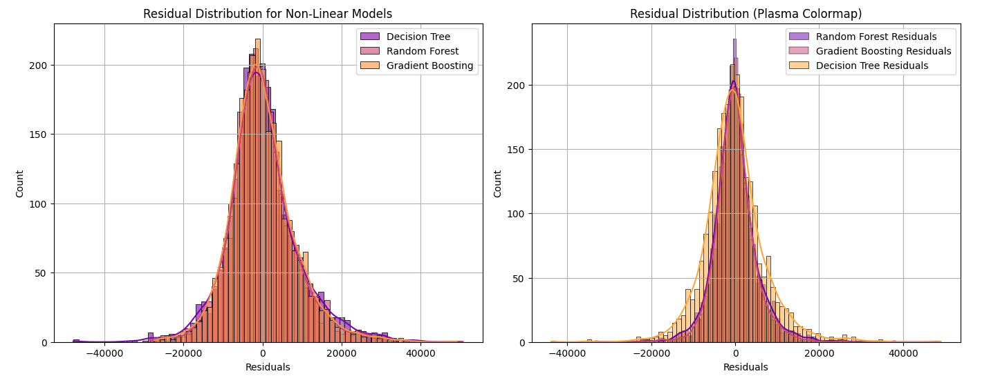
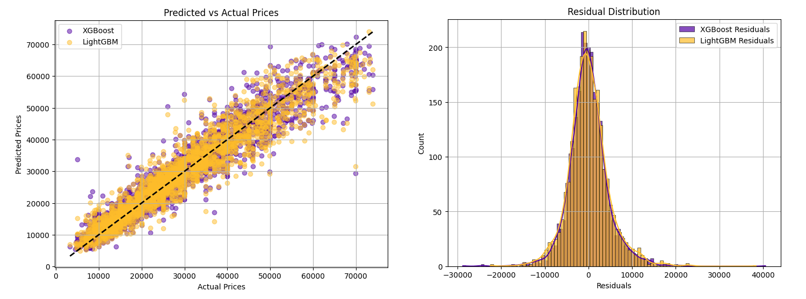

# Australian Car Price Analysis and Prediction
 

source: https://www.carco.com.au
## Project Overview
This project started as a personal interest in cars and the intention to buy a car in Australia. Given the complexities of car pricing, I wanted to understand price trends, key factors affecting costs, and the shift towards electric vehicles (EVs). 🚗

To achieve this, I collected and analyzed a dataset of cars in Australia, visualizing the dataset, applying data preprocessing, feature engineering, and machine learning models to extract meaningful insights and create accurate price predictions.📊

## Project goals and objectives
🎯 Goals:

The primary goal of this project is to analyze and predict car prices in the Australian market, providing valuable insights into pricing trends and key factors affecting car values. Through machine learning models, the project aims to improve price prediction accuracy, helping users make informed decisions when purchasing a car. Additionally, it seeks to understand the shift towards electric vehicles (EVs) and their impact on the market. By leveraging data visualization, feature engineering, and advanced models, the project aspires to create a reliable resource for car buyers, researchers, and industry analysts alike.

🔍 Key Objectives:

•	Preprocess the dataset with cleaning and encoding techniques.

•	Create interactive visualizations in Tableau to make insights more  accessible.

•	Analyze the pricing trends of cars based on various attributes.

•	Predict car prices using advanced machine learning models.

•	Investigate the growing electric vehicle (EV) market in Australia.

## About the data

This dataset offers a comprehensive snapshot of the Australian car market with 16,734 rows and 19 features featuring key attributes such as year of manufacture, kilometres driven, engine specifications, fuel consumption, and body type. It also captures car price variations across different brands and locations. This rich dataset provides a perfect foundation to uncover pricing trends, assess the impact of features like fuel type and vehicle condition, and explore how the market is evolving—particularly with the rise of electric vehicles in Australia.

## Dataset Attributes Overview

•	Brand: Name of the car manufacturer (e.g., Toyota, Ford, BMW).

•	Year: The year the car was manufactured, providing insight into the car's age.

•	Model: Specific model name of the car (e.g., Camry, Ranger).

•	Car/Suv: Classification indicating whether the vehicle is a car or SUV.

•	Title: Short description summarizing the car main features (e.g., "2021 Toyota Camry Hybrid").

•	UsedOrNew: Condition of the car—whether it is new, used, or a demo vehicle.

•	Transmission: Type of transmission the car has (e.g., Automatic, Manual).

•	Engine: Engine specifications such as engine size or displacement, often measured in liters (e.g., 2.5L).

•	DriveType: Type of drive system (e.g., 4WD, AWD, Front, Rear), indicating traction control on different terrains.

•	FuelType: The type of fuel used by the vehicle (e.g., Petrol, Diesel, Hybrid, Electric).

•	FuelConsumption: Average fuel consumption of the car, typically measured in liters per 100 kilometers (L/100km).

•	Kilometres: The total number of kilometers the car has driven, indicating usage and wear.

•	ColourExtInt: Color of the car's exterior and interior (e.g., "White/Black").

•	CylindersinEngine: Number of cylinders in the engine, which affects performance and efficiency.

•	BodyType: The design style of the vehicle body (e.g., Sedan, Hatchback, SUV, UTE).

•	Doors: Number of doors in the car (e.g., 2-door, 4-door).

•	Seats: Number of seats in the car, indicating passenger capacity.

•	Price: Selling price of the car, which is the target variable for price prediction.

## 🛠️ Tools and libraries

•	Python: For data preprocessing, model development, and evaluation.

•	Pandas: For data manipulation and cleaning.

•	NumPy: For numerical operations and efficient calculations.

•	Matplotlib: For plotting charts (e.g., scatter plots and residual distributions).

•	Seaborn: For enhanced statistical visualizations like boxplots and histograms.

•	Scikit-learn: For machine learning models, data splitting, scaling, and evaluation metrics.

•	XGBoost: For high-performance gradient boosting models.

•	LightGBM: For fast and scalable gradient boosting models.

•	Statsmodels: For statistical analysis and assumption testing.

•	Tableau: For interactive dashboards and visual analysis of data trends and distributions.

## Methodology

### Data preproccessing

#### Overview of the Data:

Utilized data.describe() and data.info() methods to understand key statistics and data types across all attributes.

```python
ds = pd.read_csv("Australian Vehicle Prices.csv")

dsdsinfo = ds.info() ds_summary = ds.describe()

print(dsinfo)

print(ds_summary)
```


Checked for missing values and overall data consistency using data.

```Python
 ds.isnull().sum() 
 ```


Checked for duplicated values and overall data consistency using data.

```Python 
ds_dup = ds.duplicated()
ds_dup
```


#### Cleaning Data:
Dropped some unimportant columns:

```Python
ds.drop(['Doors', 'Seats', 'ColourExtInt'],axis=1,inplace=True)
```

Dropped null values of 2 columns and renamed values in the BodyType columm.
"HiAce" → "Hiace"
, "Ute / Trays" → "UTE"
, "Commercial" → "Van"
, "Land" → "Land Rover"


```Python
# Ensure no NaN values in 'Model' and 'Title' columns
ds['Model'] = ds['Model'].fillna('')
ds['Title'] = ds['Title'].fillna('')

# Update 'BodyType' for models starting with "HiAce"
ds.loc[ds['Model'].str.startswith("HIACE"), "BodyType"] = "Van"

# Standardize 'HiAce' to 'Hiace' in the 'Model' and 'Title' columns
ds['Model'] = ds['Model'].str.replace('HiAce', 'Hiace', regex=False)
ds['Title'] = ds['Title'].str.replace('HiAce', 'Hiace', regex=False)

# Verify changes
changed_ds = ds[ds['Model'].str.contains("Hiace")]
changed_ds2 = ds[ds['Title'].str.contains("Hiace")]

changed_ds
```


```Python
#Change data values "Commercial", "Van" in "BodyType" column

ds.loc[ds['BodyType'] == "Commercial", "BodyType"] = "Van"

ds[ds['BodyType'] == "Van"].head()
```


```Python
ds.loc[ds['BodyType'] == "Ute / Tray", "BodyType"] = "UTE"
```

```Python
# Changing Brand name "Land Rover"

ds.loc[ds['Brand'] == "Land", "Brand"] = "Land Rover"

ds[ds['Brand'] == "Land Rover"].head()
```
Replaced inconsistent name of "Land Rover" model with correct name based on Title

```Python
def categorized_title(title, brand):
    # Return the original title for non-Land Rover cars
    if brand != "Land Rover":  
        return title

    # Check for missing values
    if pd.isna(title):  
        return "Not Found"
        
    # Convert to string to handle non-string values
    title = str(title)  
    if "Evoque" in title:
        return "Evoque"
    elif "Discovery" in title:
        return "Discovery"
    elif "HSE" in title:
        return "HSE"
    elif "Vogue" in title:
        return "Vogue"
    elif "Velar" in title:
        return "Velar"
    elif "Autobiography" in title:
        return "Autobiography"
    elif "Sport" in title:
        return "Sport"
    elif "P530" in title:
        return "P530"
    elif "Defender" in title:
        return "Defender"
    elif "Freelander" in title:
        return "Freelander"
    elif "P525" in title:
        return "P525"
    elif "D300" in title:
        return "D300"
    elif "D350" in title:
        return "D350"
    else:
        return "Not Found"

# Apply the function
ds['Model'] = ds.apply(lambda row: categorized_title(row['Title'], row['Brand']), axis=1)

ds[ds['Brand'] == "Land Rover"].head()
```


Added one column named "State" to conveniently visualize the location 

```Python
# Check if 'Location' exists in the DataFrame
if 'Location' in ds.columns:
    # Extract the last 3 characters from the 'Location' column and assign to 'States'
    ds['States'] = ds['Location'].str[-3:]
else:
    print("Column 'Location' does not exist.")

if 'Location' in ds.columns:
    # Extract the last 3 characters
    states_values = ds['Location'].str[-3:]
    
    # Get the position of 'Location'
    location_index = ds.columns.get_loc('Location')
    
    # Insert 'States' next to 'Location'
    if 'States' in ds.columns:
        ds.drop(columns=['States'], inplace=True)
    ds.insert(location_index + 1, 'States', states_values)
else:
    print("Column 'Location' does not exist.")
```

"Other" → Assigned appropriate values based on vehicle Model and Title.
```Python
ds.loc[ds['BodyType'] == "Other", "BodyType"] = ""

ds[ds['BodyType'] == "Other"]
```
Filled missing values in the BodyType column based on relevant attributes like Model and Title.
```Python
# Keywords for each body type
bodytype_keywords = {
    "Sedan": ["City", "C-CLASS", "Impreza", "Calais", "3", "5", "7", "A3", "A5", "RS", "190", "Corolla", "WRX", 
              "S-Class", "Skyline", "Axela", "Cruze", "Accord", "Sai", "E-CLASS", "Crown", "Lancer", "Jetta", 
              "S60", "M3", "Prius", "Model", "Camry", "Sonata", "Cerato", "A4", "Commodore", "Altezza", "Falcon", 
              "C320", "HS", "Flying", "6", "Sebring", "Century", "Berlina", "XJ", "300", "508", "Stanza", "120", 
              "2002", "Model 3", "Pulsar", "C200", "Ghibli"],
    "SUV": ["RAV4", "CR-V", "Tucson", "CX-5", "Forester", "Land Cruiser", "Pajero", "Outlander", "X5", "Kuga", "H2", 
            "Rover", "D90", "Evoque", "Discovery", "Landcruiser", "Sport"],
    "Hatchback": ["Yaris", "2", "Focus", "Golf", "Clio", "i30", "Civic", "Fiesta", "Swift", "Micra", "Tiida", 
                  "Fit", "Note", "MK", "Getz", "Ractis"],
    "UTE": ["Hilux", "Ranger", "Navara", "Colorado", "BT-50", "D-Max", "Triton", "Amarok", "Gladiator", "FPV", 
            "GS", "T60", "Ducato"],
    "Van": ["Hiace", "Transit", "Carnival", "Vito", "Caddy", "iLoad", "Every", "Deliver", "G10+", "Crafter", 
            "Sprinters", "Delivers"],
    "Convertible": ["MX-5", "Z4", "718", "Mustang Convertible", "TT Roadster", "Cabrio", "Corvette"],
    "Wagon": ["Passat", "Outback", "Levorg", "V60", "E-Class Wagon", "Commodore Wagon"],
    "People Mover": ["Alphard", "Vellfire", "Mifa"],
    "Truck": ["Atlas", "Trucks", "NMR", "NLS", "NLR", "Hijet"]
}

# Function to determine the body type from model (case insensitive and cleans spaces)
def get_body_type(model):
    model = model.strip().lower()  # Convert model to lowercase and strip spaces
    for body_type, keywords in bodytype_keywords.items():
        if any(keyword.lower() in model for keyword in keywords):
            return body_type
    return "Not Found"  # If no match found

# Ensure 'BodyType' column exists in the dataframe
ds['BodyType'] = ds.get('BodyType', '')

# Fill missing values only where BodyType is blank or NaN
ds['BodyType'] = ds.apply(lambda row: get_body_type(row['Model'])
                          if pd.isna(row['BodyType']) or row['BodyType'] == ''
                          else row['BodyType'], axis=1)

# Display updated rows for validation
print(ds.loc[ds['BodyType'] == 'Not Found', ['Model', 'BodyType']].head())
```
```Python
# Define the models and their respective body types to be updated
model_to_bodytype = {
    "Hijet": "Truck",
    "Alphard": "People Mover",
    "Vellfire": "People Mover",
    "Crafter": "Van",
    "Hiace": "Van"
}

# Function to update the BodyType based on the model
def update_bodytype(row):
    for model, body_type in model_to_bodytype.items():
        if model in row['Model']:
            return body_type
    return row['BodyType']  # Keep the original value if no match is found

# Apply the function to the BodyType column using .loc to avoid SettingWithCopyWarning
ds.loc[:, 'BodyType'] = ds.apply(update_bodytype, axis=1)

# Display some rows to verify the update
print(ds.loc[ds['Model'].str.contains('Hijet|Alphard|Vellfire|Crafter|Hiace', case=False), ['Model', 'BodyType']].head())
```
Changed categorical values from CylindersinEngine and Engine column

```Python
# Remove 'cyl' from CylindersinEngine and convert to numeric using .loc to avoid SettingWithCopyWarning
ds.loc[:, 'CylindersinEngine'] = ds['CylindersinEngine'].str.replace(r'\D', '', regex=True)
ds.loc[:, 'CylindersinEngine'] = pd.to_numeric(ds['CylindersinEngine'], errors='coerce')

# Move 'CylindersinEngine' next to 'Engine'
columns = ds.columns.tolist()
columns.remove('CylindersinEngine')
engine_index = columns.index('Engine')
columns.insert(engine_index + 1, 'CylindersinEngine')
ds = ds[columns]
```

```Python
# Clean 'Engine' column by keeping only the engine size and removing the cylinder count, retaining 'L' for clarity
ds['Engine'] = ds['Engine'].str.extract(r'(\d+\.\d+|\d+)(?:\s*L)', expand=False)

# Extract only the first decimal number and ignore invalid entries
ds['FuelConsumption'] = ds['FuelConsumption'].astype(str).str.extract(r'(\d+\.\d+|\d+)', expand=False)
ds['FuelConsumption'] = pd.to_numeric(ds['FuelConsumption'], errors='coerce').round(1)

# Convert 'Year' column to integer without decimal places
if 'Year' in ds.columns:
    ds['Year'] = pd.to_numeric(ds['Year'], errors='coerce').astype('Int64')
    
ds.head(5)
```


### Data visualization
#### *Overview of the Australian car's price*

 
> Average Car Price by State (Left Heat Map):

•	Northern Territory (NT) and Queensland (QLD) show the lowest average car prices, hovering around $32,000.

•	New South Wales (NSW) and Victoria (VIC) exhibit moderate average car prices in the $34,000–$36,000 range.

•	Western Australia (WA) and Northern Territory (NT) have the highest average car prices, exceeding $37,000.

> Car Supply by State (Right Bar Chart):

•	NSW dominates the market with the highest number of both new and used cars, indicating a central hub for vehicle transactions.

•	Queensland (QLD) and Victoria (VIC) also have a significant number of cars available, with a considerable balance between new and used options.

•	Smaller markets such as Tasmania (TAS), Australian Capital Territory (ACT), and Northern Territory (NT) have much lower car availability.




> Dominance of Non-Luxury Brands:

In both new and used car markets, brands such as Ford, BMW, and Mazda maintain relatively stable positions, indicating consistent market demand across both categories.

In the used car market, more economy and mid-range brands such as Kia, Mini, and MG feature prominently, suggesting increased affordability and demand for practical options in the second-hand market.

> Luxury Brands Commanding High Prices:

New Cars: Ferrari, McLaren, and Aston Martin have significantly high average prices, with Ferrari leading at $610,000. Other luxury brands like Bentley, Maserati, and Porsche also hold strong premium values.

Used Cars: Lamborghini and Ferrari still command high prices, with Lamborghini leading at $542,440. Rolls-Royce and Bentley also have substantial average prices, reflecting the retained value of high-end luxury brands in the used market.

#### *Australian average car's price by states*

 

- New South Wales

Avg Price: $43,664
> Luxury brands like Porsche and Genesis as well as some high performance sport car such as Covertte from Chevrolet push the price above average, reflecting high demand for premium cars.
- Victoria

Avg Price: $44,868
> High-end brands such as Bentley and Porsche dominate, suggesting strong demand for luxury vehicles in Melbourne.
- Queensland

Avg Price: $38,318
> A diverse market with both affordable options (Ford, Kia) and premium cars like Chevrolet.
- Australia Capital Territory

Avg Price: $36,277
> A balanced market with moderate interest in both luxury (Porsche, Jaguar) and mid-range brands (Hyundai, Honda).

 

- South Australia

Avg Price: $37,140
> Porsche and BMW influence higher prices, but affordable options like Ford and Kia maintain market balance.
- Western Australia

Avg Price: $39,524
> High-end brands like Porsche, Tesla and Chevrolet sport cars drive prices above average, indicating demand for premium vehicles.
- Northern Territory

Avg Price: $38,042
> Limited market with lower brand diversity; Ram and Toyota suprisingly stand out for higher prices, while Ford and Hyundai offer budget-friendly options.
- Tasmania

Avg Price: $37,224
> A well-balanced market with moderate interest in premium cars like Audi and Land Rover, alongside mid-range brands like Toyota and Hyundai.

#### *Australian car brands dashboard*
 
- Luxury Brands Dominate High Prices: Lamborghini, Ferrari, and McLaren lead with average prices exceeding $400,000, reflecting Australia's demand for high-end luxury cars.

- Popular Brands in Demand: Toyota stands out with 2,784 listings, making it the most popular brand, followed by Hyundai (1,239) and Holden (1,087), indicating strong consumer preference for reliable, mid-range options.

- Brand Price Variation Across States: Brands like Mercedes-Benz and Holden show significant price differences depending on the state, emphasizing regional price trends and demand variations.

- Affordability Trends: Common brands such as Ford, Hyundai, and Kia maintain moderate pricing, appealing to a broad market segment focused on cost-effective vehicles.

#### *Popular Car Types in top 4 populated State* 

- New South Wales (NSW): SUVs are the most popular body type, with 2,504 cars, followed by Hatchbacks (1,115) and UTEs (941).

- Queensland (QLD): SUVs dominate the market with 1,181 cars, with Hatchbacks (449) and UTEs (479) also being in high demand.

- Victoria (VIC): SUVs lead with 1,626 cars, while Hatchbacks (606) and Sedans (594) are other popular options.

- Western Australia (WA): SUVs maintain popularity at 792 cars, followed by UTEs (326) and Hatchbacks (268).

> SUV cars is consistently favored across all states, reflecting a preference for versatile, spacious vehicles across Australia.

#### *Australian Electric and Petrol Car*


- EV Cars have a significantly higher average price of $102,201. 

- EV cars are limited in numbers, with only 38 in NSW, 30 in Victoria, and sparse presence across other states.

According to the 2018 report by ClimateWorks Australia, EV sales in Australia rose from just 49 vehicles in 2011 to 2,284 by 2017, representing a growing trend in EV adoption​.


Despite this growth, the current map shows relatively low numbers of EV cars spread across various Australian states, with New South Wales and Victoria having relatively higher counts (30 and 38 respectively), indicating that adoption is still niche but improving in major states.

> While interest and infrastructure for EVs are increasing, they still have a long way to go in overtaking petrol cars, particularly in price accessibility for lower tier options and statewide coverage

 
- Petrol Cars have an average price of $36,053

- Petrol cars are abundant, with over 6,300 in NSW and large numbers in Victoria (3,842) and Queensland (2,732).

> Petrol cars maintain strong market dominance, suggesting a broader and more affordable range catering to different consumer segments.

#### *The relationship between Price and other factors such as Kilometres and Fuel Consumption*


Price vs Kilometres:

- The plot shows a negative correlation between price and kilometres driven. As the kilometres increase, the price drops significantly, reflecting depreciation with usage.

- High-priced cars with lower kilometres dominate the dataset, while heavily used cars show prices under $100,000 regardless of brand or type.

Price vs Fuel Consumption:

- This plot suggests a slight positive trend between price and fuel consumption. Luxury cars with high engine performance (often consuming more fuel) tend to have higher prices.

- Lower-priced vehicles generally fall in the low-to-medium fuel consumption range, reinforcing the affordability of fuel-efficient models.

### Car Price Prediction using ML model

 ## Data normalization using Label and one-hot encoder and Z-score 

Dropped null values and  converted these column values into numeric values

```Python
ds.dropna(subset=['Year', 'Engine', 'FuelConsumption', 'Kilometres', 'Price'], inplace=True)
```

```Python
ds['Year'] = pd.to_numeric(ds['Year'], errors='coerce')
ds['Engine'] = pd.to_numeric(ds['Engine'], errors='coerce')
ds['FuelConsumption'] = pd.to_numeric(ds['FuelConsumption'], errors='coerce')
ds['Kilometres'] = pd.to_numeric(ds['Kilometres'], errors='coerce')
ds['Price'] = pd.to_numeric(ds['Price'], errors='coerce')
```
- Label and one-hot encoding values

```Python
from sklearn.preprocessing import LabelEncoder

# Perform label encoding for 'Brand'
if 'Brand' in ds.columns:
    LE = LabelEncoder()
    ds['Brand'] = LE.fit_transform(ds['Brand'])

# One-hot encoding for specified categorical columns
cat_cols = ['UsedOrNew', 'Transmission', 'DriveType', 'FuelType', 'BodyType']
for col in cat_cols:
    if col in ds.columns:
        dummies = pd.get_dummies(ds[col], prefix=col).astype(int)
        ds = pd.concat([ds, dummies], axis=1)

# Display the updated dataset
print("Dataset after one-hot encoding:")
print(ds.head())
```


- Checked outliers Z-score 
```Python
from scipy.stats import zscore, shapiro
import statsmodels.api as sm

# Ensure data is numeric, coercing errors to NaN
relevant_columns = ['Kilometres', 'Engine', 'FuelConsumption', 'Price']
data = ds[relevant_columns].apply(pd.to_numeric, errors='coerce')

# Drop rows with missing or invalid data
data = data.dropna()

# Function to check for outliers using Z-score
def check_outliers_zscore(df, threshold=3):
    outliers = {}
    for col in df.columns:
        z_scores = zscore(df[col])
        outliers[col] = df[(z_scores > threshold) | (z_scores < -threshold)].shape[0]
    return outliers
```
- Checked assumptions 
```Python
# Function to visualize outliers
def plot_boxplots(df):
    plasma_cmap = sns.color_palette("plasma", len(df.columns))
    for i, col in enumerate(df.columns):
        plt.figure(figsize=(6, 4))
        sns.boxplot(x=df[col], color=plasma_cmap[i])
        plt.title(f"Boxplot of {col}", color=plasma_cmap[i])
        plt.show()

# Function to check residual normality (Shapiro-Wilk test)
def check_residual_normality(residuals):
    stat, p_value = shapiro(residuals)
    print("Shapiro-Wilk Test for Normality:")
    print(f"Statistic: {stat}, P-value: {p_value}")
    if p_value > 0.05:
        print("Residuals appear to be normally distributed.")
    else:
        print("Residuals do not appear to be normally distributed.")

# Function to calculate Variance Inflation Factor (VIF)
def calculate_vif(df):
    vif_data = pd.DataFrame()
    vif_data["Feature"] = df.columns
    vif_data["VIF"] = [
        1 / (1 - sm.OLS(df[col], sm.add_constant(df.drop(columns=[col]))).fit().rsquared)
        for col in df.columns
    ]
    return vif_data

# Drop the target column 'Price' from the features for VIF calculation
features = data.drop(columns=['Price'])

# Check and calculate VIF
vif_results = calculate_vif(features)
print("Variance Inflation Factor (VIF):")
print(vif_results)

# Outlier detection
outliers = check_outliers_zscore(data)
print("Outliers in each column (Z-Score Method):")
print(outliers)

# Plot boxplots to visualize outliers
plot_boxplots(data)

# Example Linear Regression Residual Analysis
X = data[['Kilometres', 'Engine', 'FuelConsumption']]
X = sm.add_constant(X)  # Add constant for intercept
Y = data['Price']
model = sm.OLS(Y, X).fit()
residuals = model.resid

# Check residual normality
check_residual_normality(residuals)

# Plot residuals
plt.figure(figsize=(6, 4))
sns.scatterplot(x=model.fittedvalues, y=residuals, color=sns.color_palette("plasma", 10)[5])
plt.axhline(0, color= 'black', linestyle='--')
plt.title("Residuals vs Fitted Values", color=sns.color_palette("plasma", 10)[7])
plt.xlabel("Fitted Values")
plt.ylabel("Residuals")
plt.grid()
plt.show()
```

> Variance Inflation Factor (VIF):
>           Feature       VIF
> 0       Kilometres  1.077397
> 1           Engine  1.699562
> 2  FuelConsumption  1.678795
> Outliers in each column (Z-Score Method):
> {'Kilometres': 127, 'Engine': 266, 'FuelConsumption': 314, 'Price': 208}


> Shapiro-Wilk Test for Normality:
> Statistic: 0.6460109125263298, P-value: 1.6343811843257495e-98
> Residuals do not appear to be normally distributed.


- VIF Analysis: All features have VIF values near 1, indicating no multicollinearity.

- Outliers: High number of outliers detected in "FuelConsumption" (314), "Engine" (266), and other features.

- Normality Test: Shapiro-Wilk test confirms residuals are not normally distributed (p-value extremely low).

> Outliers and non-normality violate linear regression assumptions, requiring removal and alternative models.

### *Removing outliers using IQR method and Optimizing model using feature importance*

- Removed Outliers using IQR method
```Python
from scipy.stats import zscore, shapiro
import statsmodels.api as sm

# Define a function to remove outliers using the IQR method
def remove_outliers_iqr(data, columns):
    """
    Removes rows with outliers in the specified columns based on the IQR method.

    Parameters:
        data (DataFrame): The input DataFrame.
        columns (list): List of column names to check for outliers.

    Returns:
        DataFrame: The DataFrame with outliers removed.
    """
    for col in columns:
        if col in data.columns:
            # Ensure the column is numeric
            data[col] = pd.to_numeric(data[col], errors='coerce')
            Q1 = data[col].quantile(0.25)
            Q3 = data[col].quantile(0.75)
            IQR = Q3 - Q1
            lower_bound = Q1 - 1.5 * IQR
            upper_bound = Q3 + 1.5 * IQR
            data = data[(data[col] >= lower_bound) & (data[col] <= upper_bound)]
    return data

# Specify columns to check for outliers
columns_to_check = ['Kilometres', 'Engine', 'FuelConsumption', 'Price']

# Ensure all columns are numeric before applying the IQR method
for col in columns_to_check:
    if col in ds.columns:
        ds[col] = pd.to_numeric(ds[col], errors='coerce')

# Remove outliers using the IQR method
cleaned_data = remove_outliers_iqr(ds, columns_to_check)

# Display the cleaned dataset
print("Original Data Shape:", ds.shape)
print("Cleaned Data Shape (IQR Method):", cleaned_data.shape)

# Select numeric columns for correlation analysis
relevant_columns = ['Year', 'FuelConsumption', 'Engine', 'Kilometres', 'Price']
data_for_corr = cleaned_data[relevant_columns].dropna()

# Function to visualize outliers
def plot_boxplots(cleaned_data):
    plasma_cmap = sns.color_palette("plasma", len(cleaned_data.columns))
    for i, col in enumerate(cleaned_data.columns):
        plt.figure(figsize=(6, 4))
        sns.boxplot(x=cleaned_data[col], color=plasma_cmap[i])
        plt.title(f"Boxplot of {col}", color=plasma_cmap[i])
        plt.show()

# Plot boxplots to visualize outliers
plot_boxplots(cleaned_data)
```
- Optimizing model using feature importance
```python
from sklearn.utils.validation import check_X_y
from sklearn.ensemble import RandomForestRegressor

# Ensure feature columns and target variable have the same number of rows
X = X.dropna()
y = y.dropna()

# Align X and y after dropping missing values
X, y = X.align(y, join='inner', axis=0)

# Identify non-numeric columns
non_numeric_columns = X.select_dtypes(include=['object']).columns.tolist()

if len(non_numeric_columns) > 0:
    print("Non-numeric columns detected:", non_numeric_columns)
    print(X[non_numeric_columns].head())  # View the first few rows

    # Option 1: Drop non-numeric columns if unnecessary
    X = X.drop(columns=non_numeric_columns, errors='ignore')

    # Option 2: Encode non-numeric columns if needed
    for col in non_numeric_columns:
        if col in X.columns:  # Check if column exists before processing
            if X[col].nunique() <= 10:  # Few unique values, use one-hot encoding
                dummies = pd.get_dummies(X[col], prefix=col, drop_first=True)
                X = pd.concat([X.reset_index(drop=True), dummies.reset_index(drop=True)], axis=1)
            else:  # Many unique values, use label encoding
                le = LabelEncoder()
                X[col] = le.fit_transform(X[col])

# Ensure all columns are numeric
if len(X.select_dtypes(include=['object']).columns) > 0:
    raise ValueError("There are still non-numeric columns in the dataset. Please review them.")

# Check consistency of X and y
assert len(X) == len(y), f"Mismatch in number of samples: X ({len(X)}), y ({len(y)})"

# Fit Random Forest model
rf = RandomForestRegressor(random_state=42)
rf.fit(X, y)

# Feature importance
feature_importance = pd.DataFrame({'Feature': X.columns, 'Importance': rf.feature_importances_})
feature_importance.sort_values(by='Importance', ascending=False, inplace=True)
print(feature_importance)

# Plot feature importance
plt.figure(figsize=(10, 6))
sns.barplot(x='Importance', y='Feature', data=feature_importance, palette='plasma')
plt.title("Feature Importance from Random Forest")
plt.xlabel("Importance")
plt.ylabel("Feature")
plt.tight_layout()
plt.show()
```


> Key Features for Model Training: Year, Kilometres, DriveType_Front, Engine, Brand, and FuelConsumption are the most impactful, which is considered for training

## Car Price Prediction using Machine Learning Models
### Linear regression models

For linear models, we used Lasso Regression, Ridge Regression, ElasticNet Regression

```Python
from sklearn.linear_model import LinearRegression, Lasso, Ridge, ElasticNet
from sklearn.metrics import mean_absolute_error, mean_squared_error, r2_score
from sklearn.preprocessing import StandardScaler

# Ensure numeric data and remove any missing values
X = X.apply(pd.to_numeric, errors='coerce')
X.dropna(inplace=True)

# Split the data
X_train, X_test, y_train, y_test = train_test_split(X, y, test_size=0.2, random_state=42)

# Standardize the features
scaler = StandardScaler()
X_train_scaled = scaler.fit_transform(X_train)
X_test_scaled = scaler.transform(X_test)

# Define models
models = {
    "Linear Regression": LinearRegression(),
    "Lasso Regression": Lasso(alpha=1.0),
    "Ridge Regression": Ridge(alpha=1.0),
    "ElasticNet Regression": ElasticNet(alpha=1.0, l1_ratio=0.5)
}

# Train and evaluate models
results = {}
for name, model in models.items():
    model.fit(X_train_scaled, y_train)
    y_pred = model.predict(X_test_scaled)

    mae = mean_absolute_error(y_test, y_pred)
    mse = mean_squared_error(y_test, y_pred)
    r2 = r2_score(y_test, y_pred)

    results[name] = {
        "MAE": mae,
        "MSE": mse,
        "R2 Score": r2
    }

    print(f"--- {name} ---")
    print(f"MAE: {mae:.2f}")
    print(f"MSE: {mse:.2f}")
    print(f"R2 Score: {r2:.2f}")
    print("-------------------------------")

# Compare model performance visually
results_df = pd.DataFrame(results).T

# Generate a color palette from the plasma colormap with 10 discrete colors
custom_cmap = sns.color_palette("plasma", 10)  # Generates 10 colors from plasma colormap

# Plot Model MAE Comparison
plt.figure(figsize=(10, 5))
sns.barplot(x=results_df.index, y=results_df['MAE'], hue=results_df.index, palette=custom_cmap, legend=False)
plt.title("Model MAE Comparison")
plt.ylabel("MAE")
plt.xlabel("Regression Model")
plt.grid(axis='y', linestyle='--')
plt.show()

# Plot Model MSE Comparison
plt.figure(figsize=(10, 5))
sns.barplot(x=results_df.index, y=results_df['MSE'], hue=results_df.index, palette=custom_cmap, legend=False)
plt.title("Model MSE Comparison")
plt.ylabel("MSE")
plt.xlabel("Regression Model")
plt.grid(axis='y', linestyle='--')
plt.show()

# Plot Model R2 Score Comparison
plt.figure(figsize=(10, 5))
sns.barplot(x=results_df.index, y=results_df['R2 Score'], hue=results_df.index, palette=custom_cmap, legend=False)
plt.title("Model R2 Score Comparison")
plt.ylabel("R2 Score")
plt.xlabel("Regression Model")
plt.grid(axis='y', linestyle='--')
plt.show()
```
*Lasso Regression*

- MAE: 5992.36

- MSE: 63136474.63

- R2 Score: 0.72
-------------------------------
*Ridge Regression*

- MAE: 5992.40

- MSE: 63137953.20

- R2 Score: 0.72
-------------------------------
*ElasticNet Regression*

- MAE: 6298.42

- MSE: 72658244.09

- R2 Score: 0.68


Applied Hyperparameter tunning to increase model accuracy

> Lasso and Ridge Regression: Both show identical results with a MAE of ~5992, MSE of ~63 million, and an R² score of 0.72, suggesting that these models capture the data pattern but still leave room for optimization.

> ElasticNet Regression: Performs worse with a higher MAE (~6298) and lower R² score (0.68), indicating it's less effective in its current form. 

```Python
from sklearn.model_selection import GridSearchCV

# Define hyperparameter grids for each model
param_grid_ridge = {
    'alpha': [0.01, 0.1, 1, 10, 100]
}

param_grid_lasso = {
    'alpha': [0.01, 0.1, 1, 10, 100]
}

param_grid_elasticnet = {
    'alpha': [0.01, 0.1, 1, 10, 100],
    'l1_ratio': [0.1, 0.5, 0.9]
}

# Initialize models
ridge = Ridge()
lasso = Lasso()
elastic_net = ElasticNet()

# Perform GridSearchCV for Ridge Regression
ridge_search = GridSearchCV(ridge, param_grid_ridge, cv=5, scoring='r2', n_jobs=-1)
ridge_search.fit(X_train_scaled, y_train)

# Perform GridSearchCV for Lasso Regression
lasso_search = GridSearchCV(lasso, param_grid_lasso, cv=5, scoring='r2', n_jobs=-1)
lasso_search.fit(X_train_scaled, y_train)

# Perform GridSearchCV for ElasticNet Regression
elasticnet_search = GridSearchCV(elastic_net, param_grid_elasticnet, cv=5, scoring='r2', n_jobs=-1)
elasticnet_search.fit(X_train_scaled, y_train)

# Display the best parameters and R2 scores
print("Best Ridge Regression Parameters:", ridge_search.best_params_)
print("Best Ridge R2 Score:", ridge_search.best_score_)

print("Best Lasso Regression Parameters:", lasso_search.best_params_)
print("Best Lasso R2 Score:", lasso_search.best_score_)

print("Best ElasticNet Regression Parameters:", elasticnet_search.best_params_)
print("Best ElasticNet R2 Score:", elasticnet_search.best_score_)
```

- Best Ridge Regression Parameters: {'alpha': 10}
- Best Ridge R2 Score: 0.7248487791101313
- Best Lasso Regression Parameters: {'alpha': 0.01}
- Best Lasso R2 Score: 0.7248577018946202
- Best ElasticNet Regression Parameters: {'alpha': 0.01, 'l1_ratio': 0.9}
- Best ElasticNet R2 Score: 0.7248500976273137

> The R² scores after tunning is very close to Ridge's performance, meaning 3 linear models didn't show a significant improvement. This suggests that most of the features are relevant, and all the model did not remove many.

> As linear models show limited performance, non-linear models (e.g., Random Forest, Gradient Boosting) should be considered to capture complex relationships. Therefore, we will try to apply non-linear models for better prediction.

### Non-linear regression models

For non-linear models, we applied Decision Tree, Random Forest, Gradient Boosting, 

```Python
from sklearn.tree import DecisionTreeRegressor
from sklearn.ensemble import RandomForestRegressor, GradientBoostingRegressor
from sklearn.svm import SVR

# Define non-linear models
non_linear_models = {
    "Decision Tree": DecisionTreeRegressor(max_depth=10, random_state=42),
    "Random Forest": RandomForestRegressor(n_estimators=100, max_depth=10, random_state=42),
    "Gradient Boosting": GradientBoostingRegressor(n_estimators=100, learning_rate=0.1, max_depth=5, random_state=42)
}

# Train and evaluate non-linear models
non_linear_results = {}
for name, model in non_linear_models.items():
    model.fit(X_train_scaled, y_train)
    y_pred = model.predict(X_test_scaled)

    mae = mean_absolute_error(y_test, y_pred)
    mse = mean_squared_error(y_test, y_pred)
    r2 = r2_score(y_test, y_pred)

    non_linear_results[name] = {
        "MAE": mae,
        "MSE": mse,
        "R2 Score": r2
    }

    print(f"--- {name} ---")
    print(f"MAE: {mae:.2f}")
    print(f"MSE: {mse:.2f}")
    print(f"R2 Score: {r2:.2f}")
    print("-------------------------------")

# Convert results to DataFrame and visualize
non_linear_results_df = pd.DataFrame(non_linear_results).T

# Plot results
plt.figure(figsize=(10, 5))
sns.barplot(x=non_linear_results_df.index, y=non_linear_results_df['R2 Score'], hue=non_linear_results_df.index, palette='plasma', legend=False)
plt.title("Non-Linear Regression Model R2 Score Comparison")
plt.ylabel("R2 Score")
plt.xlabel("Model")
plt.grid(axis='y', linestyle='--')
plt.show()

# Scatter plot for predicted vs actual values
plt.figure(figsize=(8, 6))
colors = sns.color_palette("plasma", len(non_linear_models))

for (name, model), color in zip(non_linear_models.items(), colors):
    y_pred = model.predict(X_test_scaled)
    plt.scatter(y_test, y_pred, alpha=0.6, label=name, color=color)

plt.plot([min(y_test), max(y_test)], [min(y_test), max(y_test)], color='black', linestyle='--')
plt.xlabel("Actual Prices")
plt.ylabel("Predicted Prices")
plt.title("Predicted vs Actual Prices for Non-Linear Models")
plt.legend()
plt.grid()
plt.show()

# Residual distribution plot using plasma colormap
plt.figure(figsize=(8, 6))

for (name, model), color in zip(non_linear_models.items(), colors):
    y_pred = model.predict(X_test_scaled)
    residuals = y_test - y_pred
    sns.histplot(residuals, kde=True, label=name, alpha=0.6, color=color)

plt.title("Residual Distribution for Non-Linear Models")
plt.xlabel("Residuals")
plt.legend()
plt.grid()
plt.show()
```

*Decision Tree*

- MAE: 5062.49

- MSE: 51054579.81

- R2 Score: 0.77
-------------------------------
*Random Forest*

- MAE: 4409.63

- MSE: 37682168.13

- R2 Score: 0.83
-------------------------------
*Gradient Boosting*

- MAE: 3949.13

- MSE: 29349643.32

- R2 Score: 0.87

Applied Hyperparameter tunning including adding features "Brand" and adjusting figure for "n_estimators", "max_depth" to increase models accurary 

```Python
# Define feature columns and target variable
feature_columns = ['Year', 'Kilometres', 'Engine', 'FuelConsumption', 'Brand']
X = cleaned_data[feature_columns]
y = cleaned_data['Price']

# Split the data
X_train, X_test, y_train, y_test = train_test_split(X, y, test_size=0.2, random_state=42)

# Standardize the features
scaler = StandardScaler()
X_train_scaled = scaler.fit_transform(X_train)
X_test_scaled = scaler.transform(X_test)

# Define parameter grid for Random Forest
rf_param_grid = {
    'n_estimators': [50, 100, 150, 500],
    'max_depth': [5, 10, 20, 30, 50],
    'min_samples_split': [2, 5, 10],
    'min_samples_leaf': [1, 2, 4]
}

# Define parameter grid for Gradient Boosting
gb_param_grid = {
    'n_estimators': [50, 100, 150, 500],
    'learning_rate': [0.01, 0.1, 0.2],
    'max_depth': [3, 5, 7, 10],
    'subsample': [0.8, 1.0]
}

# Hyperparameter tuning for Random Forest
rf = RandomForestRegressor(random_state=42)
rf_grid_search = GridSearchCV(rf, rf_param_grid, cv=5, scoring='r2', n_jobs=-1)
rf_grid_search.fit(X_train_scaled, y_train)
best_rf = rf_grid_search.best_estimator_
print("Best Random Forest Parameters:", rf_grid_search.best_params_)
print("Best Random Forest R2 Score:", rf_grid_search.best_score_)

# Hyperparameter tuning for Gradient Boosting
gb = GradientBoostingRegressor(random_state=42)
gb_grid_search = GridSearchCV(gb, gb_param_grid, cv=5, scoring='r2', n_jobs=-1)
gb_grid_search.fit(X_train_scaled, y_train)
best_gb = gb_grid_search.best_estimator_
print("Best Gradient Boosting Parameters:", gb_grid_search.best_params_)
print("Best Gradient Boosting R2 Score:", gb_grid_search.best_score_)

# Evaluate the tuned models
y_pred_rf = best_rf.predict(X_test_scaled)
y_pred_gb = best_gb.predict(X_test_scaled)
y_pred_dt = DecisionTreeRegressor(max_depth=10, random_state=42).fit(X_train_scaled, y_train).predict(X_test_scaled)

cmap = plt.get_cmap("plasma")
colors = [cmap(0.2), cmap(0.5), cmap(0.8)]  # Choosing 3 distinct colors from plasma colormap

# Plot predicted vs actuall
plt.figure(figsize=(8, 6))
plt.scatter(y_test, y_pred_rf, color=colors[0], alpha=0.6, label='Random Forest')
plt.scatter(y_test, y_pred_gb, color=colors[1], alpha=0.6, label='Gradient Boosting')
plt.scatter(y_test, y_pred_dt, color=colors[2], alpha=0.6, label='Decision Tree')

# Reference line
plt.plot([min(y_test), max(y_test)], [min(y_test), max(y_test)], color='black', lw=2, linestyle='--')

plt.xlabel("Actual Prices")
plt.ylabel("Predicted Prices")
plt.title("Predicted vs Actual Prices (Plasma Colormap)")
plt.legend()
plt.grid()
plt.show()

# Residual plots
residuals_rf = y_test - y_pred_rf
residuals_gb = y_test - y_pred_gb
residuals_dt = y_test - y_pred_dt

plt.figure(figsize=(8, 6))
sns.histplot(residuals_rf, kde=True, color=colors[0], label='Random Forest Residuals')
sns.histplot(residuals_gb, kde=True, color=colors[1], label='Gradient Boosting Residuals')
sns.histplot(residuals_dt, kde=True, color=colors[2], label='Decision Tree Residuals')

plt.title("Residual Distribution (Plasma Colormap)")
plt.xlabel("Residuals")
plt.legend()
plt.grid()
plt.show()

# Print evaluation metrics
print("Random Forest Regression Metrics:")
print(f"MAE: {mean_absolute_error(y_test, y_pred_rf):.2f}")
print(f"MSE: {mean_squared_error(y_test, y_pred_rf):.2f}")
print(f"R² Score: {r2_score(y_test, y_pred_rf):.2f}")

print("\nGradient Boosting Regression Metrics:")
print(f"MAE: {mean_absolute_error(y_test, y_pred_gb):.2f}")
print(f"MSE: {mean_squared_error(y_test, y_pred_gb):.2f}")
print(f"R² Score: {r2_score(y_test, y_pred_gb):.2f}")

print("\nDecision Tree Regression Metrics:")
print(f"MAE: {mean_absolute_error(y_test, y_pred_dt):.2f}")
print(f"MSE: {mean_squared_error(y_test, y_pred_dt):.2f}")
print(f"R² Score: {r2_score(y_test, y_pred_dt):.2f}")
```
- Best Random Forest Parameters: {'max_depth': 20, 'min_samples_leaf': 1, 'min_samples_split': 5, 'n_estimators': 500}

> Best Random Forest R2 Score: 0.8711870416728089

- Best Gradient Boosting Parameters: {'learning_rate': 0.1, 'max_depth': 7, 'n_estimators': 500, 'subsample': 0.8}

> Best Gradient Boosting R2 Score: 0.8931214990864003

 *XGBoost and LightGBM models*

```Python
from sklearn.preprocessing import StandardScaler, OneHotEncoder
from sklearn.metrics import mean_absolute_error, mean_squared_error, r2_score
from xgboost import XGBRegressor
from lightgbm import LGBMRegressor

# Define feature columns and target variable
feature_columns = ['Year', 'Kilometres', 'Engine', 'FuelConsumption', 'BodyType','Brand']
X = cleaned_data[feature_columns]
y = cleaned_data['Price']

# Drop rows with missing target variable or features
X = X.dropna(subset=feature_columns)
y = y.dropna()

# One-hot encode the categorical feature 'BodyType'
encoder = OneHotEncoder(drop='first', sparse_output=False)
bodytype_encoded = encoder.fit_transform(X[['BodyType']])
bodytype_encoded_df = pd.DataFrame(bodytype_encoded, columns=encoder.get_feature_names_out(['BodyType']))

# Drop the original categorical column and merge the encoded data
X = X.drop(columns=['BodyType'])
X = pd.concat([X.reset_index(drop=True), bodytype_encoded_df.reset_index(drop=True)], axis=1)

# Split the data
X_train, X_test, y_train, y_test = train_test_split(X, y, test_size=0.2, random_state=42)

# Standardize the numerical features
scaler = StandardScaler()
X_train_scaled = scaler.fit_transform(X_train)
X_test_scaled = scaler.transform(X_test)

# Train XGBoost model
xgb_model = XGBRegressor(
    objective='reg:squarederror',
    n_estimators=200,
    max_depth=7,
    learning_rate=0.1,
    subsample=0.8,
    random_state=42
)
xgb_model.fit(X_train_scaled, y_train)

# Train LightGBM model
lgb_model = LGBMRegressor(
    n_estimators=200,
    max_depth=7,
    learning_rate=0.1,
    num_leaves=31,
    random_state=42
)
lgb_model.fit(X_train_scaled, y_train)

# Evaluate the models
y_pred_xgb = xgb_model.predict(X_test_scaled)
y_pred_lgb = lgb_model.predict(X_test_scaled)

def evaluate_model(model_name, y_test, y_pred):
    mae = mean_absolute_error(y_test, y_pred)
    mse = mean_squared_error(y_test, y_pred)
    r2 = r2_score(y_test, y_pred)

    print(f"--- {model_name} ---")
    print(f"MAE: {mae:.2f}")
    print(f"MSE: {mse:.2f}")
    print(f"R² Score: {r2:.2f}")
    print("-------------------------------")

# Print the evaluation results
evaluate_model("XGBoost", y_test, y_pred_xgb)
evaluate_model("LightGBM", y_test, y_pred_lgb)
```
*XGBoost*

- MAE: 3228.19

- MSE: 20543356.00

- R² Score: 0.91
-------------------------------
*LightGBM*

- MAE: 3427.65

- MSE: 22514402.09

- R² Score: 0.90

### Visualizing non-linear models prediction using scatter plots
 

- Before Tuning (left charts): There was greater dispersion around the diagonal line, indicating less accurate predictions with several points significantly deviating from the actual values. Regarding the residual histogram charts, it show greaters spread and variability, indicating inconsistent prediction errors across models. The residuals deviate more from zero, suggesting suboptimal fit.



- After Tuning (right charts): The points are more concentrated along the diagonal line, reflecting improved model alignment with actual prices. This indicates that hyperparameter tuning helped the models achieve better prediction accuracy by reducing errors. Otherwise, the residuals are more concentrated around zero with a narrower distribution, indicating improved model performance and reduced error variance




### Model evaluation

| Model | Random Forest | Gradient Boosting | Decision Tree | XGBoost | LightGBM |
|-------|---------------|-------------------|---------------|---------|----------|
| MAE | 3684.26 | 3412.15 | 5146.04 | 3228.19 | 3427.65 |
| MSE | 27656611.43 | 23121459.20 | 51748071.00 | 20543356.00 | 22514402.09 |
| R^2 score | 0.88 | 0.90 | 0.77 | 0.91 | 0.90 |

- XGBoost shows the lowest MAE (3352.13) and MSE (22149432.95), indicating it's the most accurate model in predicting car prices.

- Gradient Boosting performs similarly well with an R² Score of 0.90 and relatively low error values.

- Random Forest also performs well but has slightly higher error values compared to XGBoost and LightGBM.

- Decision Tree has the highest MAE and MSE, suggesting it's the least reliable model in this comparison.


## The key insights
*The Top Factors Behind Car Prices*

 - If you’re buying a 2023 model or beyond, expect higher prices.

Why? Features like advanced technology and fuel efficiency boost value.

- Cars with low mileage are in high demand. The fewer kilometres driven, the higher the price.

*What Really Matters in a Car's Price?*

We ranked the most crucial factors, and the results were eye-opening:

 > Year, Kilometres, Engine Size, and Fuel Consumption take the top spots.

> Surprisingly, body style (SUV, sedan, UTE) or fuel type (petrol, hybrid, electric) had less influence than expected.

So don't assume a hybrid SUV will cost more just because it's trendy!

Our models competed to predict prices as accurately as possible:

*What’s Next for Car Prices After 2024?*

> Looking ahead, the market’s focus is shifting toward affordable and tech-savvy cars.

> Sustainability might soon play a bigger role. Keep an eye on incentives for electric vehicles and green technology.

*Recommendations for Car Enthusiasts and Data Experts*

> For buyers: Look at the core factors – Year, Kilometres, Engine – to understand price trends.
> For data geeks: Consider adding external market factors like depreciation or safety ratings to improve future models.


## Project challenges

During this project, several challenges emerged, particularly in the data preparation and model development phases. Below are the key issues faced and their impact on the project:

1. Data Cleaning Issues

The initial data cleaning process using Python did not fully address all incorrect values and missing data.
Some anomalies persisted, such as extreme outliers and mismatched entries in critical features like BodyType and location.
Additionally, Python scripts failed to accurately handle certain missing values due to inconsistencies in the dataset format.
As a result, I had to manually verify and correct the data using Excel, which was both time-consuming and prone to human error.

2. Dataset Limitations

The dataset lacked important features that could influence car prices, such as:

- Economic factors like depreciation and car safety ratings.
- Consumer preferences and seasonal demand patterns.

This limitation restricted the predictive accuracy and versatility of the models.

3. Model Limitations and Improvement Potential

While non-linear models like XGBoost, LightGBM and Gradient Boosting performed reasonably well, there is always room for improvement:
Hyperparameter tuning improved accuracy but could be further refined through techniques like grid search or Bayesian optimization.
The models occasionally struggled with outliers and complex non-linear relationships that were not fully captured by the current feature set.
Incorporating additional data, such as external factors, could enhance prediction performance

## Conclusion

## References
Data source: https://www.kaggle.com/datasets/nelgiriyewithana/australian-vehicle-prices
ClimateWork Australia report: https://www.aph.gov.au/DocumentStore.ashx?id=be4e9b0a-bf39-442f-8acb-9830038f3617&subId=658041
https://arena.gov.au/assets/2018/06/australian-ev-market-study-report.pdf

